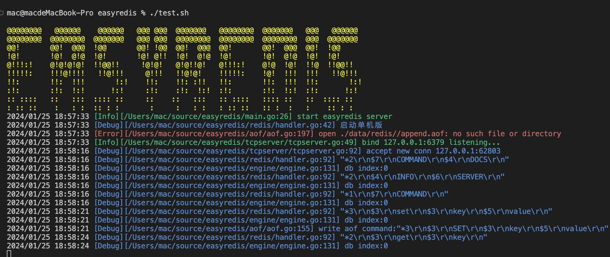
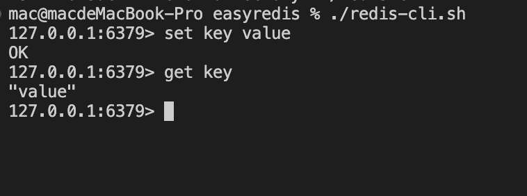
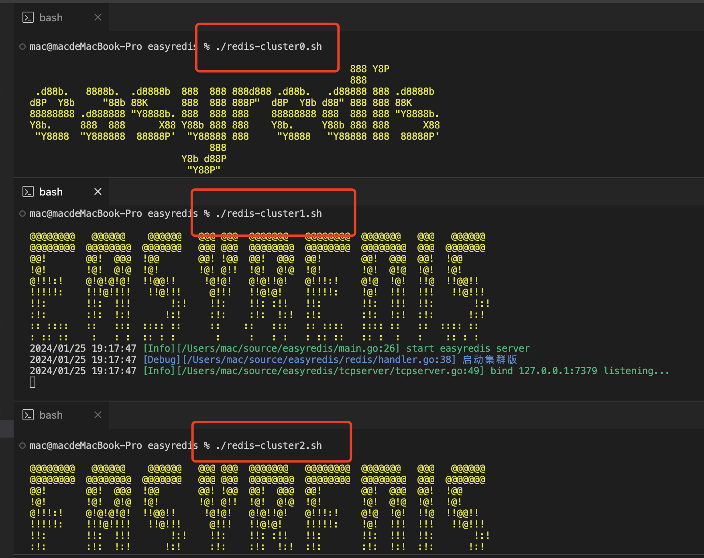
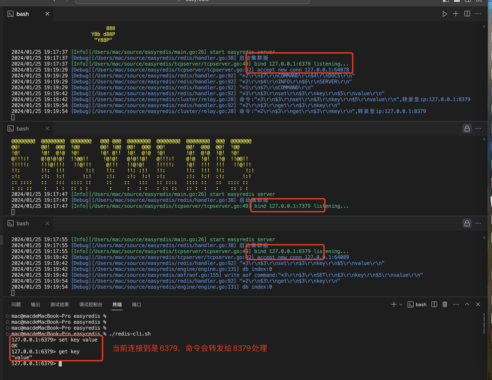

# Golang实现自己的Redis

用 11篇文章实现一个遵循标准的Redis服务，姑且叫**EasyRedis**吧，希望通过文章将Redis掰开撕碎了让大家有更直观的理解，而不是仅仅停留在八股文的层面，而是非常爽的感觉，欢迎持续关注学习。

## 单机版
- [x] [easyredis之TCP服务](https://github.com/gofish2020/easyredis/blob/main/doc/1.tcp%E6%9C%8D%E5%8A%A1/tcp%E6%9C%8D%E5%8A%A1.md) 
- [x] [easyredis之网络请求序列化协议（RESP）](https://github.com/gofish2020/easyredis/blob/main/doc/2.Redis%E5%BA%8F%E5%88%97%E5%8C%96%E5%8D%8F%E8%AE%AE/RESP.md)
- [x] [easyredis之内存数据库](https://github.com/gofish2020/easyredis/blob/main/doc/3.%E5%86%85%E5%AD%98%E6%95%B0%E6%8D%AE%E5%BA%93/%E5%86%85%E5%AD%98%E6%95%B0%E6%8D%AE%E5%BA%93.md)
- [x] [easyredis之过期时间 (时间轮实现)](https://github.com/gofish2020/easyredis/blob/main/doc/4.%E5%BB%B6%E8%BF%9F%E7%AE%97%E6%B3%95(%E6%97%B6%E9%97%B4%E8%BD%AE)/%E6%97%B6%E9%97%B4%E8%BD%AE.md)
- [x] [easyredis之持久化 （AOF实现）](https://github.com/gofish2020/easyredis/blob/main/doc/5.%E6%8C%81%E4%B9%85%E5%8C%96%E4%B9%8BAOF/aof.md)
- [x] [easyredis之发布订阅功能](https://github.com/gofish2020/easyredis/blob/main/doc/6.%E5%8F%91%E5%B8%83%E8%AE%A2%E9%98%85/%E5%8F%91%E5%B8%83%E8%AE%A2%E9%98%85.md)
- [x] [easyredis之有序集合（跳表实现）](https://github.com/gofish2020/easyredis/blob/main/doc/7.%E8%B7%B3%E8%A1%A8%E7%9A%84%E5%AE%9E%E7%8E%B0/skiplist.md)
- [x] [easyredis之 pipeline 客户端实现](https://github.com/gofish2020/easyredis/blob/main/doc/8.pipeline%E5%AE%A2%E6%88%B7%E7%AB%AF/client.md)
- [x] [easyredis之事务（原子性/回滚）](https://github.com/gofish2020/easyredis/blob/main/doc/9.%E4%BA%8B%E5%8A%A1/%E4%BA%8B%E5%8A%A1.md)

## 分布式
- [x] [easyredis之连接池](https://github.com/gofish2020/easyredis/blob/main/doc/10.%E5%AF%B9%E8%B1%A1%E6%B1%A0/pool.md)
- [x] [easyredis之分布式集群存储](https://github.com/gofish2020/easyredis/blob/main/doc/11.%E5%88%86%E5%B8%83%E5%BC%8F%E9%9B%86%E7%BE%A4/cluster.md)

## 补充篇
- [x] [分布式事务 TCC](https://github.com/gofish2020/easyredis/blob/main/doc/12.%E5%88%86%E5%B8%83%E5%BC%8F%E4%BA%8B%E5%8A%A1TCC/tcc.md)

## 使用说明

### 单机版
- 使用`./test.sh`命令启动单机版服务端
- 使用`./redis-cli.sh`命令启动官方端redis客户端，连接服务（需要你本机自己安装redis-cli并加入到环境变量中）

效果图如下：
启动服务端

客户端连接：

### 分布式

- 使用`./redis-cluster0.sh` `./redis-cluster1.sh` `./redis-cluster2.sh`命令启动3个服务端
- 使用`./redis-cli.sh`命令启动官方端redis客户端，连接服务（需要你本机自己安装redis-cli并加入到环境变量中）

效果图如下
启动服务端

客户端连接：

