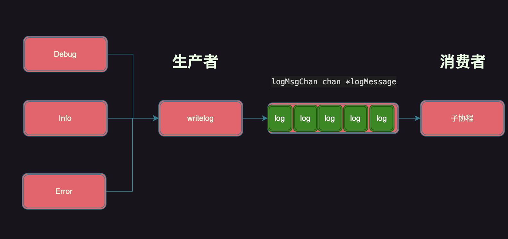
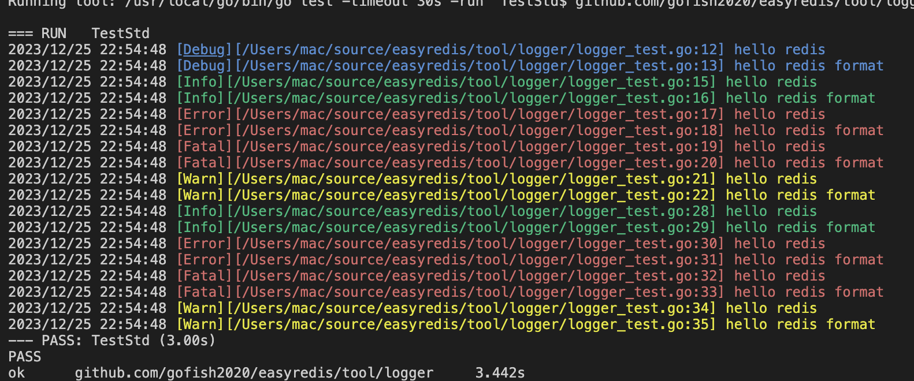
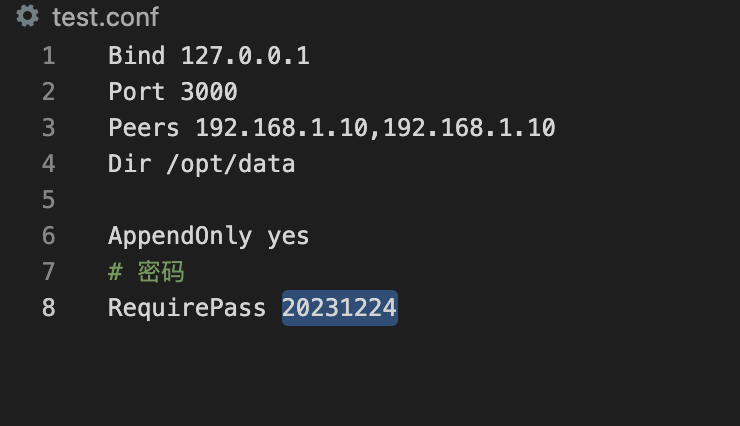
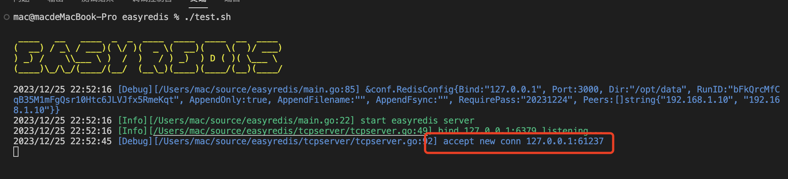
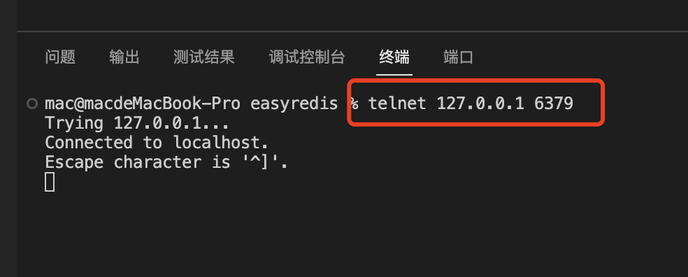

# Golang实现自己的Redis（TCP篇）

用11篇文章实现一个可用的Redis服务，姑且叫**EasyRedis**吧，希望通过文章将Redis掰开撕碎了呈现给大家，而不是仅仅停留在八股文的层面，并且有非常爽的感觉，欢迎持续关注学习。

项目代码地址: https://github.com/gofish2020/easyredis 欢迎Fork & Star

- [x] easyredis之TCP服务 
- [ ] easyredis之网络请求序列化协议（RESP）
- [ ] easyredis之内存数据库
- [ ] easyredis之过期时间 (时间轮实现)
- [ ] easyredis之持久化 （AOF实现）
- [ ] easyredis之发布订阅功能
- [ ] easyredis之有序集合（跳表实现）
- [ ] easyredis之 pipeline 客户端实现
- [ ] easyredis之事务（原子性/回滚）
- [ ] easyredis之连接池
- [ ] easyredis之分布式集群存储

## 【第一篇】EasyRedis之TCP服务 

通过本篇文章可以学到什么？

- 如何构建一个日志库(包括：生产者/消费者模型)
- 如何解析一个redis的conf配置文件(包括：文件按行读取/reflect的使用)
- 如何实现一个TCP服务(包括：tcp服务的编写/服务优雅退出)


## 日志库实现 
代码路径: `tool/logger`

代码设计的思路：**生产者消费者模型**
 - `writeLog`负责将数据保存到 `logMsgChan chan *logMessage`通道中（生产者）
 - 启动单独的goroutine从 `logMsgChan chan *logMessage`中读取数据（消费者），同时将日志输出到文件or命令行中
 - 好处在于：解耦、通过写入缓冲而非直接输出到文件，提升写入并发能力

 


日志打印效果：不同的日志级别用不同的颜色区分

对外提供通用的日志函数

```go
func Debug(msg string) {
	if defaultLogger.logLevel >= DEBUG {
		defaultLogger.writeLog(DEBUG, callerDepth, msg)
	}
}
func Debugf(format string, v ...any) {
	if defaultLogger.logLevel >= DEBUG {
		msg := fmt.Sprintf(format, v...)
		defaultLogger.writeLog(DEBUG, callerDepth, msg)
	}
}

func Info(msg string) {
	if defaultLogger.logLevel >= INFO {
		defaultLogger.writeLog(INFO, callerDepth, msg)
	}
}

func Infof(format string, v ...any) {
	if defaultLogger.logLevel >= INFO {
		msg := fmt.Sprintf(format, v...)
		defaultLogger.writeLog(INFO, callerDepth, msg)
	}
}

func Warn(msg string) {
	if defaultLogger.logLevel >= WARN {
		defaultLogger.writeLog(WARN, callerDepth, msg)
	}
}

func Warnf(format string, v ...any) {
	if defaultLogger.logLevel >= WARN {
		msg := fmt.Sprintf(format, v...)
		defaultLogger.writeLog(WARN, callerDepth, msg)
	}
}

func Error(msg string) {
	if defaultLogger.logLevel >= ERROR {
		defaultLogger.writeLog(ERROR, callerDepth, msg)
	}
}

func Errorf(format string, v ...any) {
	if defaultLogger.logLevel >= ERROR {
		msg := fmt.Sprintf(format, v...)
		defaultLogger.writeLog(ERROR, callerDepth, msg)
	}
}

func Fatal(msg string) {
	if defaultLogger.logLevel >= FATAL {
		defaultLogger.writeLog(FATAL, callerDepth, msg)
	}
}

func Fatalf(format string, v ...any) {
	if defaultLogger.logLevel >= FATAL {
		msg := fmt.Sprintf(format, v...)
		defaultLogger.writeLog(FATAL, callerDepth, msg)
	}
}
```

`writelog`函数
```go
func (l *logger) writeLog(level LogLevel, callerDepth int, msg string) {
	var formattedMsg string
	_, file, line, ok := runtime.Caller(callerDepth)
	if ok {
		formattedMsg = fmt.Sprintf("[%s][%s:%d] %s", levelFlags[level], file, line, msg)
	} else {
		formattedMsg = fmt.Sprintf("[%s] %s", levelFlags[level], msg)
	}

	// 对象池，复用*logMessage对象
	logMsg := l.logMsgPool.Get().(*logMessage)
	logMsg.level = level
	logMsg.msg = formattedMsg
	// 保存到chan缓冲中
	l.logMsgChan <- logMsg
}
```

`goroutine协程`

```go
go func() {

	for {
		select {
		case <-fileLogger.close:
			return
		case logMsg := <-fileLogger.logMsgChan:
			//检查是否跨天，重新生成日志文件
			logFilename := fmt.Sprintf("%s-%s.%s", settings.Name, time.Now().Format(settings.DateFormat), settings.Ext)

			if path.Join(settings.Path, logFilename) != fileLogger.logFile.Name() {

				fd, err := utils.OpenFile(logFilename, settings.Path)
				if err != nil {
					panic("open log " + logFilename + " failed: " + err.Error())
				}

				fileLogger.logFile.Close()
				fileLogger.logFile = fd
			}

			msg := logMsg.msg
			// 根据日志级别，增加不同的颜色
			switch logMsg.level {
			case DEBUG:
				msg = Blue + msg + Reset
			case INFO:
				msg = Green + msg + Reset
			case WARN:
				msg = Yellow + msg + Reset
			case ERROR, FATAL:
				msg = Red + msg + Reset
			}
			// 标准输出
			fileLogger.logStd.Output(0, msg)
			// 输出到文件
			fileLogger.logFile.WriteString(time.Now().Format(utils.DateTimeFormat) + " " + logMsg.msg + utils.CRLF)
		}
	}
}()

```


## conf配置文件解析
代码路径: `tool/conf`

核心思想：
- 按照行读取`.conf`配置文件,将解析的结果保存到 `lineMap`中；
- 利用`reflect`将`lineMap`中保存的结果，存储到 `*RedisConfig`对象中

conf文件内容格式为(看代码请参考):



```go

func parse(r io.Reader) *RedisConfig {

	newRedisConfig := &RedisConfig{}

	//1.按行扫描文件
	lineMap := make(map[string]string)
	scanner := bufio.NewScanner(r)

	for scanner.Scan() {
		line := scanner.Text()
		line = strings.TrimLeft(line, " ")

		// 空行 or 注释行
		if len(line) == 0 || (len(line) > 0 && line[0] == '#') {
			continue
		}

		// 解析行  例如: Bind 127.0.0.1
		idx := strings.IndexAny(line, " ")
		if idx > 0 && idx < len(line)-1 {
			key := line[:idx]
			value := strings.Trim(line[idx+1:], " ")
			// 将每行的结果，保存到lineMap中
			lineMap[strings.ToLower(key)] = value
		}
	}

	if err := scanner.Err(); err != nil {
		logger.Error(err.Error())
	}

	//2.将扫描结果保存到newRedisConfig 对象中

	configValue := reflect.ValueOf(newRedisConfig).Elem()
	configType := reflect.TypeOf(newRedisConfig).Elem()

	// 遍历结构体字段（类型）
	for i := 0; i < configType.NumField(); i++ {

		fieldType := configType.Field(i)
		// 读取字段名
		fieldName := strings.Trim(fieldType.Tag.Get("conf"), " ")
		if fieldName == "" {
			fieldName = fieldType.Name
		} else {
			fieldName = strings.Split(fieldName, ",")[0]
		}
		fieldName = strings.ToLower(fieldName)
		// 判断该字段是否在config中有配置
		fieldValue, ok := lineMap[fieldName]

		if ok {
			// 将结果保存到字段中
			switch fieldType.Type.Kind() {
			case reflect.String:
				configValue.Field(i).SetString(fieldValue)
			case reflect.Bool:
				configValue.Field(i).SetBool("yes" == fieldValue)
			case reflect.Int:
				intValue, err := strconv.ParseInt(fieldValue, 10, 64)
				if err == nil {
					configValue.Field(i).SetInt(intValue)
				}
			case reflect.Slice:
				// 切片的元素是字符串
				if fieldType.Type.Elem().Kind() == reflect.String {
					tmpSlice := strings.Split(fieldValue, ",")
					configValue.Field(i).Set(reflect.ValueOf(tmpSlice))
				}
			}
		}
	}
	return newRedisConfig
}

```


## TCP服务实现
代码路径: `tcpserver`

### 创建tcp服务对象

```go

func NewTCPServer(conf TCPConfig, handler redis.Handler) *TCPServer {
	server := &TCPServer{
		conf:          conf,
		closeTcp:      0,
		clientCounter: 0,
		quit:          make(chan os.Signal, 1),
		redisHander:   handler,
	}
	return server
}

```

### 启动tcp服务
```go

func (t *TCPServer) Start() error {
	// 开启监听
	listen, err := net.Listen("tcp", t.conf.Addr)
	if err != nil {
		return err
	}
	t.listener = listen
	logger.Infof("bind %s listening...", t.conf.Addr)
	// 接收连接
	go t.accept()
	// 阻塞于信号
	signal.Notify(t.quit, syscall.SIGINT, syscall.SIGTERM, syscall.SIGHUP, syscall.SIGQUIT)
	<-t.quit
	return nil
}

// accept 死循环接收新连接的到来
func (t *TCPServer) accept() error {

	for {
		conn, err := t.listener.Accept()
		if err != nil {
			if ne, ok := err.(net.Error); ok && ne.Timeout() {
				logger.Infof("accept occurs temporary error: %v, retry in 5ms", err)
				time.Sleep(5 * time.Millisecond)
				continue
			}
			// 说明监听listener出错，无法接收新连接
			logger.Warn(err.Error())
			atomic.CompareAndSwapInt32(&t.closeTcp, 0, 1)
			// 整个进程退出
			t.quit <- syscall.SIGTERM
			// 结束 for循环
			break
		}
		// 启动一个协程处理conn
		go t.handleConn(conn)
	}

	return nil
}

```
### 处理连接请求

- waitDone 用于优雅关闭
- clientCounter记录当前客户端连接数量
- redisHander.Handle 就是下一篇文章要实现的功能，解析RESP请求数据
```go

func (t *TCPServer) handleConn(conn net.Conn) {
	// 如果已关闭，新连接不再处理
	if atomic.LoadInt32(&t.closeTcp) == 1 {
		// 直接关闭
		conn.Close()
		return
	}

	logger.Debugf("accept new conn %s", conn.RemoteAddr().String())
	t.waitDone.Add(1)
	atomic.AddInt64(&t.clientCounter, 1)
	defer func() {
		t.waitDone.Done()
		atomic.AddInt64(&t.clientCounter, -1)
	}()

	// TODO :处理连接
	t.redisHander.Handle(context.Background(), conn)
}

```


### 关闭服务

```go
// 退出前,清理
func (t *TCPServer) Close() {
	logger.Info("graceful shutdown easyredis server")

	atomic.CompareAndSwapInt32(&t.closeTcp, 0, 1)
	// 关闭监听
	t.listener.Close()
	// 关闭处理对象
	t.redisHander.Close()
	// 阻塞中...
	t.waitDone.Wait()
}

```


最终效果展示:
利用telnet连接服务端，可以看到服务端可以正常的`accept`到连接，并打印日志




欢迎持续关注学习：
项目代码地址: https://github.com/gofish2020/easyredis 欢迎Fork & Star