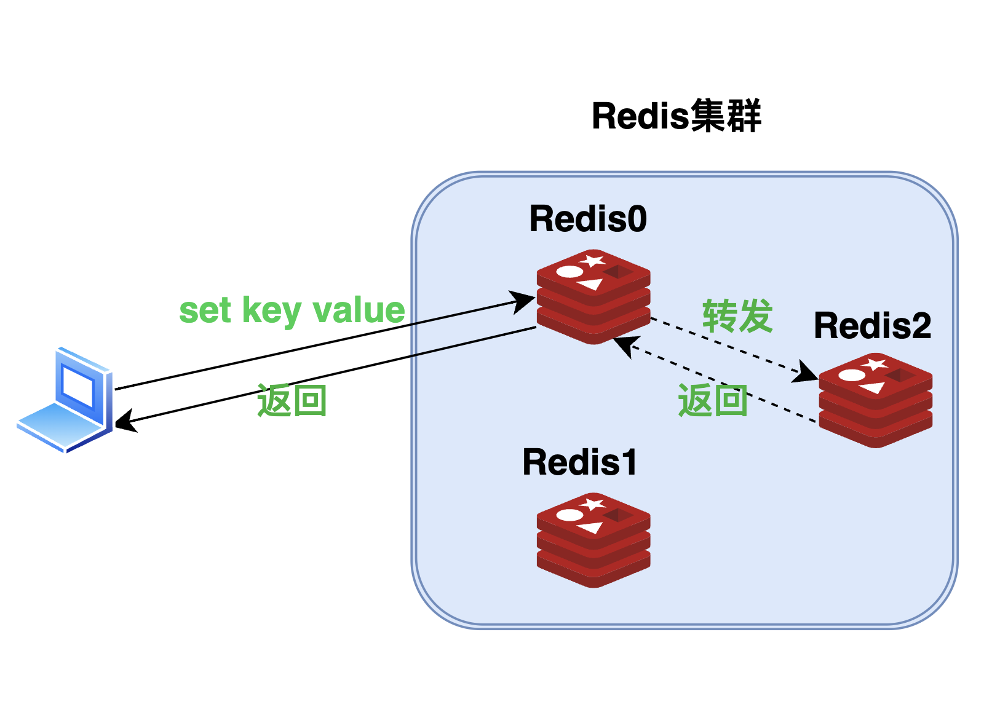
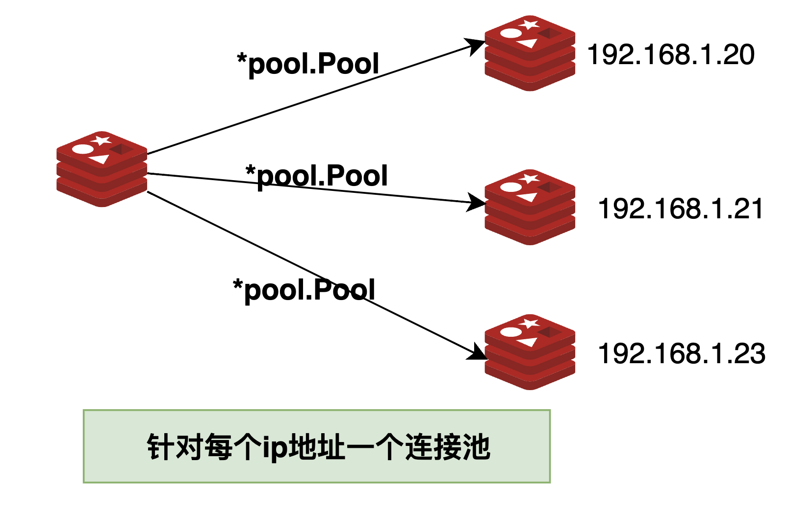

用11篇文章实现一个可用的Redis服务，姑且叫**EasyRedis**吧，希望通过文章将Redis掰开撕碎了呈现给大家，而不是仅仅停留在八股文的层面，并且有非常爽的感觉，欢迎持续关注学习。

项目代码地址: https://github.com/gofish2020/easyredis 欢迎Fork & Star

- [x] easyredis之TCP服务 
- [x] easyredis之网络请求序列化协议（RESP）
- [x] easyredis之内存数据库
- [x] easyredis之过期时间 (时间轮实现)
- [x] easyredis之持久化 （AOF实现）
- [x] easyredis之发布订阅功能
- [x] easyredis之有序集合（跳表实现）
- [x] easyredis之 pipeline 客户端实现
- [x] easyredis之事务（原子性/回滚）
- [x] easyredis之连接池
- [ ] easyredis之分布式集群存储


### 【第十篇】Redis之连接池

通过本篇可以学到什么？
- 通道的应用
- 连接池的封装

从本篇开始，实现分布式相关的代码。既然是分布式，那么`redis key`就会分布（分散）在不同的集群节点上。



当客户端发送`set key value`命令给`Redis0`服务，通过hash计算如果该key应该保存在`Redis2`服务，那么`Redis0`就要连接`Redis2`服务，并将命令转发给`Redis2`进行处理。

在命令的转发的过程中，需要频繁的连接**分布式节点**，所以我们需要先实现连接池的基本功能，复用连接。

在[第八篇pipeline客户端](https://mp.weixin.qq.com/s?__biz=MzkwMTE3NTY5MQ==&mid=2247484296&idx=1&sn=44aca704812e0e71386348769c190c03&chksm=c0b9836cf7ce0a7aafb150d7c59415ffbc9a20a865d5baf96bec24dc4f8d66ccbc33decfd4f0&token=1787556969&lang=zh_CN#rd)我们已经实现了**客户端连接**，本篇需要实现一个**池子的功能**将已经使用完的连接缓存起来，等到需要使用的时候，再取出来继续使用。


代码路径`tool/pool/pool.go`，代码量**160行**

### 池子结构体定义
- 既然是池子，那定义的数据结构里面肯定要有个**缓冲的变量**，这里就是`idles chan any`
- 一开始池子中肯定是没有对象的，所以需要有个能够创建对象的函数 `newObject`
- 配套有个释放对象的函数`freeObject`
- 池子中的对象不可能让他无限的增多，当达到`activeCount`个对象的时候，就不再继续用`newObject`生成新对象，需要等之前的对象回收以后，才能获取到对象（这里不理解往下继续看）

```go

type Pool struct {
	Config

	// 创建对象
	newObject func() (any, error)
	// 释放对象
	freeObject func(x any)

	// 空闲对象池
	idles chan any

	mu          sync.Mutex
	activeCount int        // 已经创建的对象个数
	waiting     []chan any // 阻塞等待

	closed bool // 是否已关闭
}


func NewPool(new func() (any, error), free func(x any), conf Config) *Pool {

	if new == nil {
		logger.Error("NewPool argument new func is nil")
		return nil
	}

	if free == nil {
		free = func(x any) {}
	}

	p := Pool{
		Config:      conf,
		newObject:   new,
		freeObject:  free,
		activeCount: 0,
		closed:      false,
	}
	p.idles = make(chan any, p.MaxIdles)
	return &p
}

```

### 从池子中获取对象

- `p.mu.Lock()`加锁（race condition）
- 从空闲缓冲`idles`中获取一个之前缓冲的对象
- 如果没有获取到就调用`p.getOne()`新创建一个
- 在`func (p *Pool) getOne() (any, error)`函数中，会判断当前池子中是否(历史上)已经创建了足够多的对象`p.activeCount >= p.Config.MaxActive `，那就不创建新对象，**阻塞等待回收**；否则调用`newObject`函数创建新对象

```go
func (p *Pool) Get() (any, error) {
	p.mu.Lock()
	if p.closed {
		p.mu.Unlock()
		return nil, ErrClosed
	}
	select {
	case x := <-p.idles: // 从空闲中获取
		p.mu.Unlock() // 解锁
		return x, nil
	default:
		return p.getOne() // 获取一个新的
	}
}

func (p *Pool) getOne() (any, error) {

	// 说明已经创建了太多对象
	if p.activeCount >= p.Config.MaxActive {

		wait := make(chan any, 1)
		p.waiting = append(p.waiting, wait)
		p.mu.Unlock()
		// 阻塞等待
		x, ok := <-wait
		if !ok {
			return nil, ErrClosed
		}
		return x, nil
	}

	p.activeCount++
	p.mu.Unlock()
	// 创建新对象
	x, err := p.newObject()
	if err != nil {
		p.mu.Lock()
		p.activeCount--
		p.mu.Unlock()
		return nil, err
	}
	return x, nil
}


```

### 池子对象回收

回收的过程就是对象缓存的过程，当然也要有个“度”
- 先加锁
- 回收前先判断是否有阻塞等待回收`len(p.waiting) > 0`,这里的逻辑和上面的等待阻塞逻辑对应起来了
- 如果没有阻塞等待的，那就直接将对象保存到缓冲中`idles`中
- 这里还有一个逻辑，缓冲有个大小限制（不可能无限的缓冲，多余不使用的对象，我们将它释放了，占用内存也没啥意义）

```go
func (p *Pool) Put(x any) {
	p.mu.Lock()
	if p.closed {
		p.mu.Unlock()
		p.freeObject(x) // 直接释放
		return
	}

	//1.先判断等待中
	if len(p.waiting) > 0 {
		// 弹出一个（从头部）
		wait := p.waiting[0]
		temp := make([]chan any, len(p.waiting)-1)
		copy(temp, p.waiting[1:])
		p.waiting = temp
		wait <- x // 取消阻塞
		p.mu.Unlock()
		return

	}
	// 2.直接放回空闲缓冲
	select {
	case p.idles <- x:
		p.mu.Unlock()
	default: // 说明空闲已满
		p.activeCount-- // 对象个数-1
		p.mu.Unlock()
		p.freeObject(x) // 释放
	}

}

```


### 再次封装（socket连接池）



上面的代码已经完全实现了一个池子的功能；但是我们在实际使用的时候，每个ip地址对应一个连接池，所以这里又增加了一个结构体`RedisConnPool`，结合上面的池子功能，再配合之前的pipleline客户端的功能，实现socket连接池。


代码路径：`cluster/conn_pool.go`
代码逻辑：
- 用一个字典key表示ip地址，value表示上面实现的池对象
- `GetConn`获取一个ip地址对应的连接
- `ReturnConn`归还连接到连接池中
```go
type RedisConnPool struct {
	connDict *dict.ConcurrentDict // addr -> *pool.Pool
}

func NewRedisConnPool() *RedisConnPool {

	return &RedisConnPool{
		connDict: dict.NewConcurrentDict(16),
	}
}

func (r *RedisConnPool) GetConn(addr string) (*client.RedisClent, error) {

	var connectionPool *pool.Pool // 对象池

	// 通过不同的地址addr，获取不同的对象池
	raw, ok := r.connDict.Get(addr)
	if ok {
		connectionPool = raw.(*pool.Pool)
	} else {

		// 创建对象函数
		newClient := func() (any, error) {
			// redis的客户端连接
			cli, err := client.NewRedisClient(addr)
			if err != nil {
				return nil, err
			}
			// 启动
			cli.Start()
			if conf.GlobalConfig.RequirePass != "" { // 说明服务需要密码
				reply, err := cli.Send(aof.Auth([]byte(conf.GlobalConfig.RequirePass)))
				if err != nil {
					return nil, err
				}
				if !protocol.IsOKReply(reply) {
					return nil, errors.New("auth failed:" + string(reply.ToBytes()))
				}
				return cli, nil
			}
			return cli, nil
		}

		// 释放对象函数
		freeClient := func(x any) {
			cli, ok := x.(*client.RedisClent)
			if ok {
				cli.Stop() // 释放
			}
		}

		// 针对addr地址，创建一个新的对象池
		connectionPool = pool.NewPool(newClient, freeClient, pool.Config{
			MaxIdles:  1,
			MaxActive: 20,
		})
		// addr -> *pool.Pool
		r.connDict.Put(addr, connectionPool)
	}

	// 从对象池中获取一个对象
	raw, err := connectionPool.Get()
	if err != nil {
		return nil, err
	}
	conn, ok := raw.(*client.RedisClent)
	if !ok {
		return nil, errors.New("connection pool make wrong type")
	}
	return conn, nil
}

func (r *RedisConnPool) ReturnConn(peer string, cli *client.RedisClent) error {
	raw, ok := r.connDict.Get(peer)
	if !ok {
		return errors.New("connection pool not found")
	}
	raw.(*pool.Pool).Put(cli)
	return nil
}

```