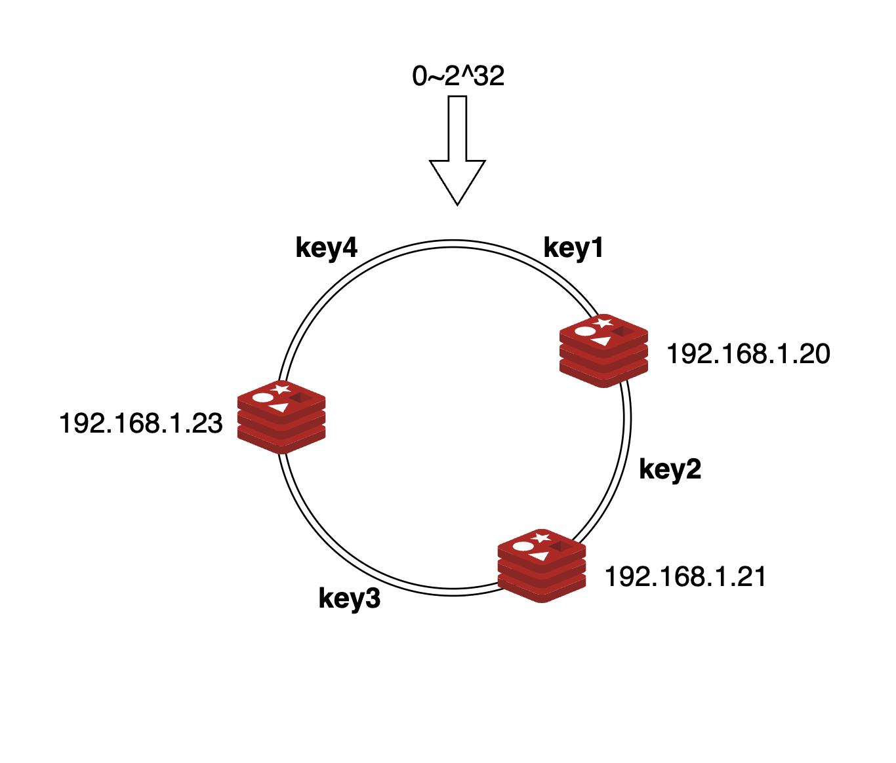
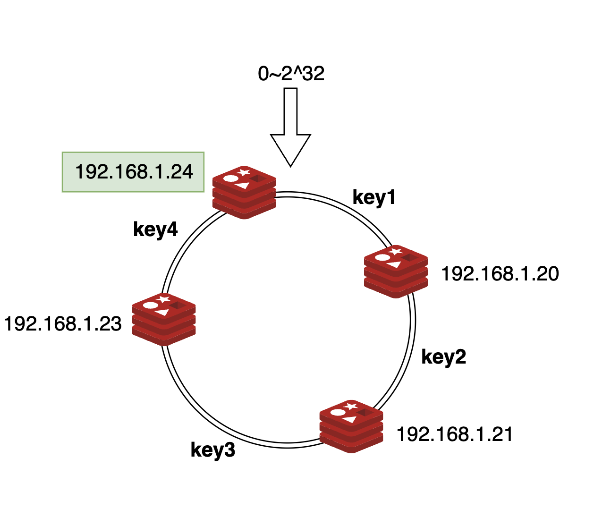
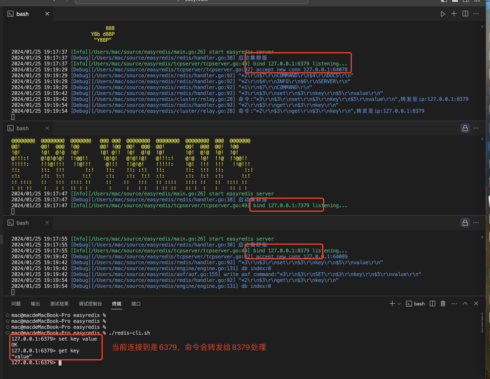

用11篇文章实现一个可用的Redis服务，姑且叫**EasyRedis**吧，希望通过文章将Redis掰开撕碎了呈现给大家，而不是仅仅停留在八股文的层面，并且有非常爽的感觉，欢迎持续关注学习。

项目代码地址: https://github.com/gofish2020/easyredis 欢迎Fork & Star

- [x] easyredis之TCP服务 
- [x] easyredis之网络请求序列化协议（RESP）
- [x] easyredis之内存数据库
- [x] easyredis之过期时间 (时间轮实现)
- [x] easyredis之持久化 （AOF实现）
- [x] easyredis之发布订阅功能
- [x] easyredis之有序集合（跳表实现）
- [x] easyredis之 pipeline 客户端实现
- [x] easyredis之事务（原子性/回滚）
- [x] easyredis之连接池
- [x] easyredis之分布式集群存储
- [ ] easyredis之分布式事务

## 分布式集群


### 一致性hash算法

为什么需要一致性 hash?
在采用分片方式建立分布式缓存时，我们面临的第一个问题是如何决定存储数据的节点。最自然的方式是参考 hash 表的做法，假设集群中存在 n 个节点，我们用 `node = hashCode(key) % n` 来决定所属的节点。

普通 hash 算法解决了如何选择节点的问题，但在分布式系统中经常出现增加节点或某个节点宕机的情况。若节点数 n 发生变化, 大多数 `key` 根据 `node = hashCode(key) % n` 计算出的节点都会改变。这意味着若要在 n 变化后维持系统正常运转，需要将大多数数据在节点间进行重新分布。这个操作会消耗大量的时间和带宽等资源，这在生产环境下是不可接受的。

算法原理
一致性 hash 算法的目的是在节点数量 n 变化时, 使尽可能少的 key 需要进行节点间重新分布。一致性 hash 算法将数据 key 和服务器地址 addr 散列到 2^32 的空间中。

我们将 2^32 个整数首尾相连形成一个环，首先计算服务器地址 addr 的 hash 值放置在环上。然后计算 key 的 hash 值放置在环上，**顺时针查找**，将数据放在找到的的第一个节点上。


`key1 key4`归属于 `192.168.1.20`节点
`key2`归属于 `192.168.1.21`节点
`key3`归属于 `192.168.1.23`节点

在增加或删除节点时只有该节点附近的数据需要重新分布，从而解决了上述问题。

新增 节点`192.168.1.24` 后，`key4` 从 `192.168.1.20` 转移到 `192.168.1.24`其它 key 不变


一般来说环上的节点越多数据分布越均匀，不过我们不需要真的增加一台服务器，只需要将实际的服务器节点映射为几个**虚拟节点**放在环上即可。


### 代码实现

代码路径`tool/consistenthash/consistenthash.go`

数据结构体定义：

```go
type HashFunc func(data []byte) uint32

type Map struct {
	hashFunc  HashFunc       // 计算hash函数
	replicas  int            // 每个节点的虚拟节点数量
	hashValue []int          // hash值
	hashMap   map[int]string // hash值映射的真实节点
}

/*
replicas：副本数量
fn：hash函数
*/
func New(replicas int, fn HashFunc) *Map {
	m := &Map{
		replicas: replicas,
		hashFunc: fn,
		hashMap:  make(map[int]string),
	}
	if m.hashFunc == nil {
		m.hashFunc = crc32.ChecksumIEEE
	}
	return m
}
```

服务启动时，添加主机节点

```go

// 添加 节点
func (m *Map) Add(ipAddrs ...string) {
	for _, ipAddr := range ipAddrs {
		if ipAddr == "" {
			continue
		}
		// 每个ipAddr 生成 m.replicas个哈希值副本
		for i := 0; i < m.replicas; i++ {
			hash := int(m.hashFunc([]byte(strconv.Itoa(i) + ipAddr)))
			// 记录hash值
			m.hashValue = append(m.hashValue, hash)
			// 映射hash为同一个ipAddr
			m.hashMap[hash] = ipAddr
		}
	}
	sort.Ints(m.hashValue)
}
```

获取key归属的节点

```go

// Get gets the closest item in the hash to the provided key.
func (m *Map) Get(key string) string {
	if m.IsEmpty() {
		return ""
	}

	partitionKey := getPartitionKey(key)
	hash := int(m.hashFunc([]byte(partitionKey)))

	// 查找 m.keys中第一个大于or等于hash值的元素索引
	idx := sort.Search(len(m.hashValue), func(i int) bool { return m.hashValue[i] >= hash }) //

	// 表示找了一圈没有找到大于or等于hash值的元素，那么默认是第0号元素
	if idx == len(m.hashValue) {
		idx = 0
	}

	// 返回 key应该存储的ipAddr
	return m.hashMap[m.hashValue[idx]]
}

// support hash tag  example :{key}
func getPartitionKey(key string) string {
	beg := strings.Index(key, "{")
	if beg == -1 {
		return key
	}
	end := strings.Index(key, "}")
	if end == -1 || end == beg+1 {
		return key
	}
	return key[beg+1 : end]
}
```


### 集群实现

代码路径 `cluster/cluster.go`


集群启动的时候，基于配置文件中的`peers`，初始化一致性hash对象`consistHash *consistenthash.Map`
```go
const (
	replicas = 100 // 副本数量
)

type Cluster struct {
	// 当前的ip地址
	self string
	// socket连接池
	clientFactory *RedisConnPool
	// Redis存储引擎
	engine *engine.Engine

	// 一致性hash
	consistHash *consistenthash.Map
}

func NewCluster() *Cluster {
	cluster := Cluster{
		clientFactory: NewRedisConnPool(),
		engine:        engine.NewEngine(),
		consistHash:   consistenthash.New(replicas, nil),
		self:          conf.GlobalConfig.Self,
	}

	// 一致性hash初始化
	contains := make(map[string]struct{})
	peers := make([]string, 0, len(conf.GlobalConfig.Peers)+1)
	// 去重
	for _, peer := range conf.GlobalConfig.Peers {
		if _, ok := contains[peer]; ok {
			continue
		}
		peers = append(peers, peer)
	}
	peers = append(peers, cluster.self)
	cluster.consistHash.Add(peers...)
	return &cluster
}

```

当节点接收到客户端发送来的Redis命令的时候，从注册中心`clusterRouter`，获取命令处理函数
```go
func (cluster *Cluster) Exec(c abstract.Connection, redisCommand [][]byte) (result protocol.Reply) {
	defer func() {
		if err := recover(); err != nil {
			logger.Warn(fmt.Sprintf("error occurs: %v\n%s", err, string(debug.Stack())))
			result = protocol.NewUnknownErrReply()
		}
	}()

	name := strings.ToLower(string(redisCommand[0]))
	routerFunc, ok := clusterRouter[name]
	if !ok {
		return protocol.NewGenericErrReply("unknown command '" + name + "' or not support command in cluster mode")
	}
	return routerFunc(cluster, c, redisCommand)
}
```

这里暂时只注册了`set get `命令,在处理函数`defultFunc`中，会调用`cluster.consistHash.Get(key)`函数基于一致性hash算法，计算key应该由哪个节点处理（其实就是节点的ip地址）

```go

type clusterFunc func(cluster *Cluster, conn abstract.Connection, args [][]byte) protocol.Reply

var clusterRouter = make(map[string]clusterFunc)

func init() {

	clusterRouter["set"] = defultFunc
	clusterRouter["get"] = defultFunc
}

func defultFunc(cluster *Cluster, conn abstract.Connection, redisCommand [][]byte) protocol.Reply {
	key := string(redisCommand[1])
	peer := cluster.consistHash.Get(key)
	return cluster.Relay(peer, conn, redisCommand) // 将命令转发

}
```


最后在 `Relay`函数中，基于`peer string`参数，判断该ip地址是当前节点的ip还是其他的节点ip；如果是远程节点，将使用上篇文件介绍的连接池，连接节点并将命令转发
```go
func (cluster *Cluster) Relay(peer string, conn abstract.Connection, redisCommand [][]byte) protocol.Reply {

	// ******本地执行******
	if cluster.self == peer {
		return cluster.engine.Exec(conn, redisCommand)
	}

	// ******发送到远端执行******

	client, err := cluster.clientFactory.GetConn(peer) // 从连接池中获取一个连接
	if err != nil {
		logger.Error(err)
		return protocol.NewGenericErrReply(err.Error())
	}

	defer func() {
		cluster.clientFactory.ReturnConn(peer, client) // 归还连接
	}()

	logger.Debugf("命令:%q,转发至ip:%s", protocol.NewMultiBulkReply(redisCommand).ToBytes(), peer)
	reply, err := client.Send(redisCommand) // 发送命令
	if err != nil {
		logger.Error(err)
		return protocol.NewGenericErrReply(err.Error())
	}

	return reply
}
```

### 效果图如下：




这里实现的集群其实比较简陋，集群的元数据信息都是在配置文件中写死，实际线上的产品会使用 `gossip or raft`协议维护集群（也就是可以动态的增加/较少节点），这个等我学会了，会再把这块重新写一下。