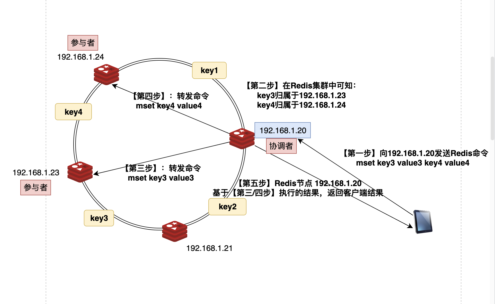
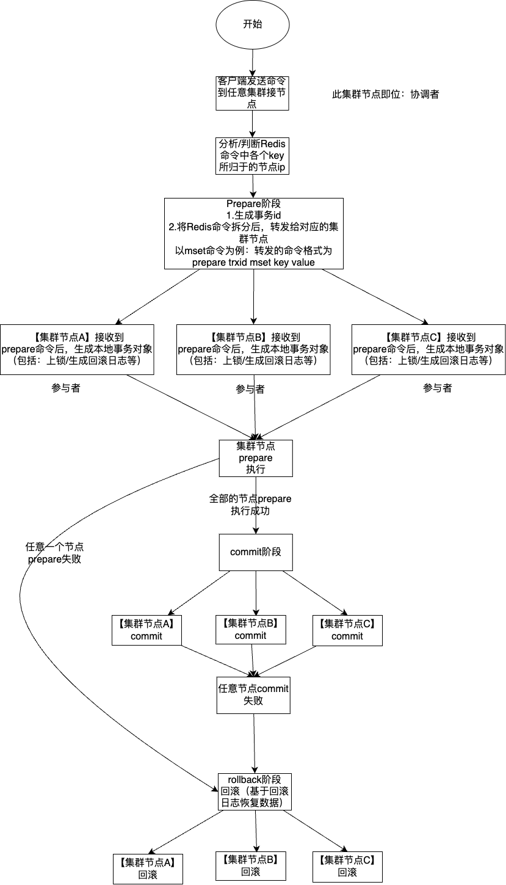

项目代码地址: https://github.com/gofish2020/easyredis 欢迎Fork & Star

## 【第十二篇】分布式事务TCC【补充篇】


在上一篇文章中我们使用一致性 hash 算法将缓存中的 `key` 分散到不同的服务器节点中，从而实现了分布式缓存。随之而来的问题是：一条指令(比如 `MSET key value [key value...]`)可能需要多个节点同时执行，可能有些节点成功而另一部分节点失败。我们需要保证 MSET 操作要么全部成功要么全部失败



在执行【第四步】或者【第三步】的时候，可能会执行失败（或者执行成功），分布式事务需要保证，要么全部失败，要么全部成功，不能存在部分失败的情况。


### 两阶段提交

两阶段提交(2-Phase Commit, 2PC)算法是解决我们遇到的一致性问题最简单的算法。在 2PC 算法中写操作被分为两个阶段来执行:

- Prepare 阶段

【协调者】向所有【参与者】发送事务内容，询问是否可以执行事务操作。在 EasyRedis 中收到客户端 `MSET` 命令的节点是事务的【协调者】(参考上图)，所有持有相关 key 的节点都要参与事务。

各【参与者】锁定事务相关 `key`（资源） 防止被其它操作修改，并且记录 `undo log` 准备在事务失败后进行回滚。

【参与者】回复【协调者】可以提交。若【协调者】收到所有【参与者】的`YES`回复，则准备进行事务提交。若有参与者回复`NO`或者超时，则准备回滚事务.
- Commit 阶段

【协调者】向所有【参与者】发送提交请求
【参与者】正式提交事务，并在完成后释放相关 key 的锁。
【参与者】向【协调者】回复ACK，协调者收到【所有参与者】的ACK后认为事务提交成功。
- Rollback 阶段

在事务请求阶段若有【参与者】回复`NO`或者超时，【协调者】向【所有参与者】发出回滚请求
各【参与者】执行事务回滚，并在完成后释放相关资源。

【参与者】向【协调者】回复ACK，【协调者】收到【所有参与者】的ACK后认为事务回滚成功。



### 存在的问题:

**单点服务**: 若协调者突然崩溃则事务流程无法继续进行或者造成状态不一致
**无法保证一致性**: 若协调者第二阶段发送提交请求时崩溃，可能部分参与者受到COMMIT请求提交了事务，而另一部分参与者未受到请求而放弃事务造成不一致现象。
**阻塞**: 为了保证事务完成提交，各参与者在完成第一阶段事务执行后必须锁定相关资源直到正式提交，影响系统的吞吐量。


### 代码实现

代码阅读顺序`cluster/router.go`

先从注册的`MSet`命令的处理函数开始看起
```go

func init() {

	// 在集群节点上注册的命令
	registerClusterRouter("Set", defultFunc)
	registerClusterRouter("Get", defultFunc)
	registerClusterRouter("MSet", mset)

	registerClusterRouter("Prepare", prepareFunc)
	registerClusterRouter("Rollback", rollbackFunc)
	registerClusterRouter("Commit", commitFunc)

	// 表示命令直接在存储引擎上执行命令
	registerClusterRouter("Direct", directFunc)
}

```

该函数中的处理流程就是按照上图的流程图来处理：
- 先对命令进行校验，并提取出命令中的`key value`
- 接着利用一致性hash算法`cluster.groupByKeys(keys)`，算出key应该在哪个ip集群节点上执行
- 如果key属于同一个集群节点，直接当作普通命令直接转发执行，不走事务（因为事务要锁定资源，比较耗时）
- 如果key属于不同的集群节点，执行`Prepare`阶段，本质就是通过网络,对集群节点（不是所有的集群节点，而是一致性hash算出来的ip节点）发送`prepare txid mset key value [key value...]`命令
- 如果`prepare`命令在集群中的所有节点执行成功，就发送`commit txid`命令，提交事务
- 否则发送`rollback txid`命令，全部回滚


执行`mset`函数的这个集群节点就是【协调者】,被连接接收转发的`prepare`命令的节点就是【参与者】

```go
// mset key value [key value...]
func mset(cluster *Cluster, c abstract.Connection, redisCommand [][]byte) protocol.Reply {

	// 基础校验
	if len(redisCommand) < 3 {
		return protocol.NewArgNumErrReply("mset")
	}

	argsNum := len(redisCommand) - 1
	if argsNum%2 != 0 {
		return protocol.NewArgNumErrReply("mset")
	}

	//1.从命令中，提取出 key value
	size := argsNum / 2
	keys := make([]string, 0, size)
	values := make(map[string]string)
	for i := 0; i < size; i++ {
		keys = append(keys, string(redisCommand[2*i+1]))
		values[keys[i]] = string(redisCommand[2*i+2])
	}

	//2.计算key映射的ip地址;  ip -> []string
	ipMap := cluster.groupByKeys(keys)

	// 3.说明keys映射为同一个ip地址，直接转发执行（不需要走分布式事务）
	if len(ipMap) == 1 {
		for ip := range ipMap {
			return cluster.Relay(ip, c, pushCmd(redisCommand, "Direct"))
		}
	}

	// 4.prepare阶段
	var respReply protocol.Reply = protocol.NewOkReply()
	// 事务id
	txId := cluster.newTxId()
	rollback := false
	for ip, keys := range ipMap {
		// txid mset key value [key value...]
		argsGroup := [][]byte{[]byte(txId), []byte("mset")}
		for _, key := range keys {
			argsGroup = append(argsGroup, []byte(key), []byte(values[key]))
		}
		//发送命令： prepare txid mset key value [key value...]
		reply := cluster.Relay(ip, c, pushCmd(argsGroup, "Prepare"))
		if protocol.IsErrReply(reply) { // 说明失败
			respReply = reply
			rollback = true
			break
		}
	}

	if rollback { // 如果prepare阶段失败， 向所有节点请求回滚
		rollbackTransaction(cluster, c, txId, ipMap)
	} else { // 所有节点都可以提交
		_, reply := commitTransaction(cluster, c, txId, ipMap)
		if reply != nil {
			respReply = reply
		}
	}
	return respReply
}

```


接下来看下 `prepare commit rollback`命令的处理逻辑
代码路径：`cluster/tcc.go`

#### Prepare

- 创建事务对象 `tx := NewTransaction(txId, redisCommand[2:], cluster, conn)`保存`redis command`等资源，并将事务对象缓存起来`cluster.transactions[txId] = tx`
- 执行`err := tx.prepare()`
- 在 ` tx.prepare()`函数内部做的事情就是【锁定资源和生成回滚日志】（目的：在需要回滚的时候，执行回滚）

```go

// ***********************Prepare/Commit/Rollback命令处理函数***********************
// prepare txid mset key value [key value...]
func prepareFunc(cluster *Cluster, conn abstract.Connection, redisCommand [][]byte) protocol.Reply {

	if len(redisCommand) < 3 {
		return protocol.NewArgNumErrReply("prepare")
	}

	txId := string(redisCommand[1])

	// 创建事务对象
	tx := NewTransaction(txId, redisCommand[2:], cluster, conn)

	// 存储对象
	cluster.transactionLock.Lock()
	cluster.transactions[txId] = tx
	cluster.transactionLock.Unlock()

	// prepare事务
	err := tx.prepare()
	if err != nil {
		return protocol.NewGenericErrReply(err.Error())
	}

	// 3s后如果事务还没有提交，自动回滚（避免长时间锁定）
	cluster.delay.Add(maxPrepareTime, genTxKey(txId), func() {
		tx.mu.Lock()
		defer tx.mu.Unlock()
		if tx.status == preparedStatus {
			tx.rollback()
			cluster.transactionLock.Lock()
			defer cluster.transactionLock.Unlock()
			delete(cluster.transactions, tx.txId)
		}
	})
	return protocol.NewOkReply()
}


type Transaction struct {
	txId         string              // transaction id
	redisCommand [][]byte            // redis命令
	cluster      *Cluster            // 集群对象
	conn         abstract.Connection // socket连接
	dbIndex      int                 // 数据库索引

	writeKeys  []string  // 写key
	readKeys   []string  // 读key
	keysLocked bool      // 是否对写key/读key已经上锁
	undoLog    []CmdLine // 回滚日志

	status transactionStatus // 事务状态
	mu     *sync.Mutex       // 事务锁（操作事务对象的时候上锁）
}

func NewTransaction(txId string, cmdLine [][]byte, cluster *Cluster, c abstract.Connection) *Transaction {
	return &Transaction{
		txId:         txId,
		redisCommand: cmdLine,
		cluster:      cluster,
		conn:         c,
		dbIndex:      c.GetDBIndex(),
		status:       createdStatus,
		mu:           &sync.Mutex{},
	}
}

func (tx *Transaction) prepare() error {

	// 1.上锁
	tx.mu.Lock()
	defer tx.mu.Unlock()
	// 2.获取读写key
	readKeys, writeKeys := engine.GetRelatedKeys(tx.redisCommand)
	tx.readKeys = readKeys
	tx.writeKeys = writeKeys
	// 3. 锁定节点资源
	tx.locks()
	// 4.生成回滚日志
	tx.undoLog = tx.cluster.engine.GetUndoLogs(tx.dbIndex, tx.redisCommand)
	tx.status = preparedStatus
	return nil
}

```


#### rollback
当节点接收到 `rollback txid`命令
- 从 `cluster.transactions`中基于事务id获取事务对象（这个是在上面的prepare中保存的）
- 如果能获取到事务对象，执行回滚事务 ` tx.rollback()`
- 在 ` tx.rollback()`函数内部，就是执行`prepare`阶段保存的回滚日志
```go
// rollback txid
func rollbackFunc(cluster *Cluster, conn abstract.Connection, redisCommand [][]byte) protocol.Reply {

	if len(redisCommand) != 2 {
		return protocol.NewArgNumErrReply("rollback")
	}
	cluster.transactionLock.RLock()
	tx, ok := cluster.transactions[string(redisCommand[1])]
	cluster.transactionLock.RUnlock()
	if !ok {
		return protocol.NewIntegerReply(0) // 事务不存在
	}

	tx.mu.Lock()
	defer tx.mu.Unlock()

	// 回滚事务
	err := tx.rollback()
	if err != nil {
		return protocol.NewGenericErrReply(err.Error())
	}

	// 延迟6s删除事务对象
	cluster.delay.Add(waitBeforeCleanTx, "", func() {
		cluster.transactionLock.Lock()
		defer cluster.transactionLock.Unlock()
		delete(cluster.transactions, tx.txId)
	})

	return protocol.NewIntegerReply(1)
}


func (tx *Transaction) rollback() error {
	if tx.status == rolledBackStatus { // no need to rollback a rolled-back transaction
		return nil
	}
	tx.locks()
	for _, cmdLine := range tx.undoLog { // 执行回滚日志
		tx.cluster.engine.ExecWithLock(tx.dbIndex, cmdLine)
	}
	tx.unlocks()
	tx.status = rolledBackStatus
	return nil
}


```

#### commit

当节点接收到 `commit txid`命令
- 从 `cluster.transactions`中基于事务id获取事务对象（这个是在上面的prepare中保存的）
- 如果能获取到事务对象，执行回滚事务 ` tx.commit()`
- 在 `tx.commit`函数内部，执行`prepare`阶段保存的待执行`redis command`,如果执行失败，需要自动回滚
```go
// commit txid
func commitFunc(cluster *Cluster, conn abstract.Connection, redisCommand [][]byte) protocol.Reply {

	if len(redisCommand) != 2 {
		return protocol.NewArgNumErrReply("commit")
	}

	cluster.transactionLock.RLock()
	tx, ok := cluster.transactions[string(redisCommand[1])]
	cluster.transactionLock.RUnlock()
	if !ok {
		return protocol.NewIntegerReply(0) // 事务不存在
	}

	return tx.commit()
}


func (tx *Transaction) commit() protocol.Reply {
	tx.mu.Lock()
	defer tx.mu.Unlock()
	if tx.status == committedStatus {
		return protocol.NewIntegerReply(0)
	}

	tx.locks()
	reply := tx.cluster.engine.ExecWithLock(tx.dbIndex, tx.redisCommand)
	if protocol.IsErrReply(reply) {
		tx.rollback() // commit 失败，自动回滚
		return reply
	}
	tx.status = committedStatus
	tx.unlocks()

	// 保留事务对象6s
	tx.cluster.delay.Add(waitBeforeCleanTx, "", func() {
		tx.cluster.transactionLock.Lock()
		delete(tx.cluster.transactions, tx.txId)
		tx.cluster.transactionLock.Unlock()
	})
	return reply
}
```