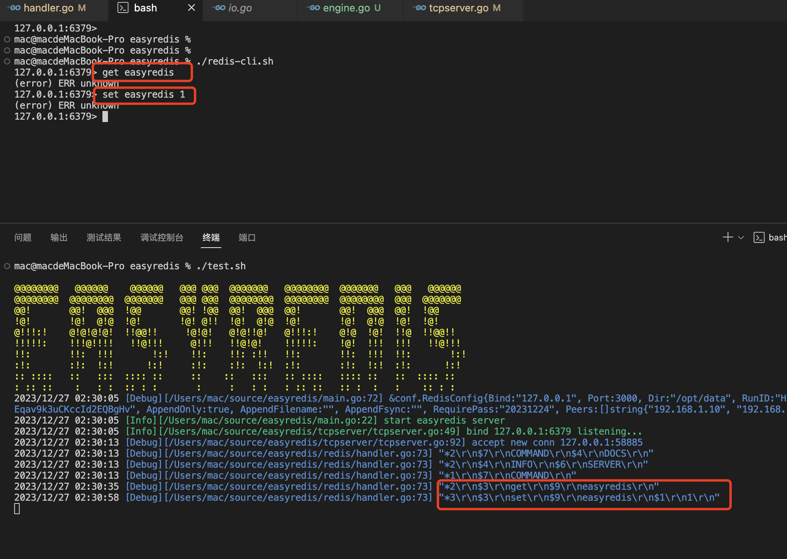

# Golang实现自己的Redis（Redis网络协议篇）

用11篇文章实现一个可用的Redis服务，姑且叫**EasyRedis**吧，希望通过文章将Redis掰开撕碎了呈现给大家，而不是仅仅停留在八股文的层面，并且有非常爽的感觉，欢迎持续关注学习。

项目代码地址: https://github.com/gofish2020/easyredis 欢迎Fork & Star

- [x] easyredis之TCP服务 
- [x] easyredis之网络请求序列化协议（RESP）
- [ ] easyredis之内存数据库
- [ ] easyredis之过期时间 (时间轮实现)
- [ ] easyredis之持久化 （AOF实现）
- [ ] easyredis之发布订阅功能
- [ ] easyredis之有序集合（跳表实现）
- [ ] easyredis之 pipeline 客户端实现
- [ ] easyredis之事务（原子性/回滚）
- [ ] easyredis之连接池
- [ ] easyredis之分布式集群存储


## 【第二篇】EasyRedis之网络请求序列化协议（RESP）


### Redis 协议格式

全名叫: Redis serialization protocol  (RESP) 官网地址 ：https://redis.io/docs/reference/protocol-spec/#bulk-strings


RESP 定义了5种格式：

- 简单字符串(Simple String): 服务器用来返回简单的结果，比如"OK"。非二进制安全，且不允许换行。
- 错误信息(Error): 服务器用来返回简单的错误信息，比如"ERR Invalid Synatx"。非二进制安全，且不允许换行。
- 整数(Integer): llen、scard 等命令的返回值, 64位有符号整数
- 字符串(Bulk String): 二进制安全字符串, 比如 get 等命令的返回值
- 数组(Array, 又称 Multi Bulk Strings): Bulk String 数组，客户端发送指令以及 lrange 等命令响应的格式

**5种格式通过第一个字符来区分**：

- 简单字符串：以`+` 开始， 如：`+OK\r\n`
---
- 错误：以`-` 开始，如：`-ERR Invalid Synatx\r\n`
---
- 整数：以`:` 开始，如：`:1\r\n`
---
- 字符串：以 `$` 开始，如： `$3\r\nSET\r\n`,3表示字符串set的字节长度为3，后面跟上实际的字符串SET。 
有个特例：`$-1` 表示 nil, 比如使用 get 命令查询一个不存在的key时，响应即为`$-1`
---
- 数组：以 `*` 开始

比如我们在命令行中常写的命令`set key value`在`redis-cli`通过网络发送给服务器端的时候，其实发送的是`*3\r\n$3\r\nSET\r\n$3\r\nkey\r\n$5\r\nvalue\r\n`

|  *3    | 表示命令由3个部分组成（set key value）      |
| ---- | ---- |
|   \r\n   | 分隔符     |
|   $3   |  表示 set的字节长度为3    |
|   \r\n    |   分隔符   |
|   SET   |  就是set   |
|   \r\n | 分隔符|
| $3| 表示key的字节长度为3 |
|   \r\n | 分隔符|
| key| 就是key|
|   \r\n | 分隔符|
|  $5| 表示value的字节长度为5 |
|   \r\n | 分隔符|
|   value | 就是表示value |
|   \r\n | 分隔符|

---


### 代码实现


通过上篇文章可以，我们需要实现一个`redisHander`处理连接，本质就是要用到本篇协议解析规则

```go
func (t *TCPServer) handleConn(conn net.Conn) {
	// ...代码省略...
	
	logger.Debugf("accept new conn %s", conn.RemoteAddr().String())

	// TODO :处理连接
	t.redisHander.Handle(context.Background(), conn)
}
```

代码路径：`redis/handler.go`

关键函数`Handle`如下：代码思路就是启动一个协程`parser.ParseStream(conn)`负责从conn中按照`\r\n`为分隔符，读取数据，并保存到chan中；然后在`Handle`中读取 chan的数据，这里其实又使用到了**生产者消费者模型**
```go
// 该方法是不同的conn复用的方法，要做的事情就是从conn中读取出符合RESP格式的数据；
// 然后针对消息格式，进行不同的业务处理
func (h *RedisHandler) Handle(ctx context.Context, conn net.Conn) {

	h.activeConn.Store(conn, struct{}{})

	outChan := parser.ParseStream(conn)
	for payload := range outChan {
		if payload.Err != nil {
			// 网络conn关闭
			if payload.Err == io.EOF || payload.Err == io.ErrUnexpectedEOF || strings.Contains(payload.Err.Error(), "use of closed network connection") {
				h.activeConn.Delete(conn)
				conn.Close()
				logger.Warn("client closed:" + conn.RemoteAddr().String())
				return
			}

			// 解析出错 protocol error
			errReply := protocol.NewGenericErrReply(payload.Err.Error())
			_, err := conn.Write(errReply.ToBytes())
			if err != nil {
				h.activeConn.Delete(conn)
				conn.Close()
				logger.Warn("client closed:" + conn.RemoteAddr().String() + " err info: " + err.Error())
				return
			}
			continue
		}

		if payload.Reply == nil {
			logger.Error("empty payload")
			continue
		}

		reply, ok := payload.Reply.(*protocol.MultiBulkReply)
		if !ok {
			logger.Error("require multi bulk protocol")
			continue
		}

		logger.Debugf("%q", string(reply.ToBytes()))

		result := h.engine.Exec(conn, reply.RedisCommand)
		if result != nil {
			conn.Write(result.ToBytes())
		} else {
			conn.Write(protocol.NewUnknownErrReply().ToBytes())
		}
	}
}
```

查看`parser.ParseStream(conn)`内部代码，可知协议解析逻辑主要在 `redis/parser.go`文件中的 `parse`函数中，代码注释很清晰。


```go
// 从r中读取数据，将读取的结果通过 out chan 发送给外部使用（包括：正常的数据包 or 网络错误）
func parse(r io.Reader, out chan<- *Payload) {

	// 异常恢复，避免未知异常
	defer func() {
		if err := recover(); err != nil {
			logger.Error(err, string(debug.Stack()))
		}
	}()

	reader := bufio.NewReader(r)
	for {

		// 按照 \n 分隔符读取一行数据
		line, err := reader.ReadBytes('\n')
		if err != nil { // 一般是 io.EOF错误（说明conn关闭or文件尾部）
			out <- &Payload{Err: err}
			close(out)
			return
		}
		// 读取到的line中包括 \n 分割符
		length := len(line)

		// RESP协议是按照 \r\n 分割数据
		if length <= 2 || line[length-2] != '\r' { // 说明是空白行，忽略
			continue
		}

		// 去掉尾部 \r\n
		line = bytes.TrimSuffix(line, []byte{'\r', '\n'})

		// 协议文档 ：https://redis.io/docs/reference/protocol-spec/
		// The first byte in an RESP-serialized payload always identifies its type. Subsequent bytes constitute the type's contents.
		switch line[0] {
		case '*': // * 表示数组
			err := parseArrays(line, reader, out)
			if err != nil {
				out <- &Payload{Err: err}
				close(out)
				return
			}
		default:
			args := bytes.Split(line, []byte{' '})
			out <- &Payload{
				Reply: protocol.NewMultiBulkReply(args),
			}
		}
	}
}

```

唯一需要强调的一个点`RESP`协议一直强调 字符串(Bulk String): **二进制安全字符串**,在代码中是如何实现的？？
从conn中读取数据，我们是按照`\r\n`为分隔符号获取一串字节，那如果数据本身就带有`\r\n`，那肯定就有问题了。
例如字符串原样输出样式为: ` $5\r\nva\r\nl\r\n` `$5` 表示字符串长度为5【`va\r\nl`】，所以在读取到5的时候，我们不能继续按照`\r\n`为分隔符号读取，而是使用 `io.ReadFull(reader, body)`函数直接读取5个字节

```go
// 基于数字5 读取 5+2 长度的数据，这里的2表示\r\n
body := make([]byte, dataLen+2)
// 注意：这里直接读取指定长度的字节
_, err := io.ReadFull(reader, body)
if err != nil {
    return err
}
// 所以最终读取到的是 hello\r\n，去掉\r\n 保存到 lines中
lines = append(lines, body[:len(body)-2])
```

### 效果展示

用官方的`redis-cli` 客户端连接自己的EasyRedis服务，并发送 `get easyredis` 和 `set easyredis 1` 命令，基于 Redis序列化协议，我们可以正确的解析出命令，格式为:
```go
*2\r\n$3\r\nget\r\n$9\r\neasyredis\r\n
*3\r\n$3\r\nset\r\n$9\r\neasyredis\r\n$1\r\n1\r\n
```


下篇文章就是在内存数据库中完成对命令的KV存储（敬请期待）


### 扩展知识
在上篇文章解析conf文件用了到了 `NewScanner`,本篇文章将使用`NewReader`从网络连接中读取数据包进行解析


**`NewReader 和 NewScanner` 介绍（来自ChatGPT)**: 

> 在 Go 语言中，NewReader 和 NewScanner 分别是 bufio 包中的两个函数，用于创建不同类型的读取器。


```go
func NewReader(rd io.Reader) *Reader
```
NewReader 用于创建一个新的 Reader 对象，该对象实现了 io.Reader 接口，并提供了一些额外的缓冲功能。它会使用默认的缓冲区大小（4096 字节）。

示例：

```go
file, err := os.Open("example.txt")
if err != nil {
    log.Fatal(err)
}
defer file.Close()
reader := bufio.NewReader(file)

```
这里创建了一个从文件中读取的 bufio.Reader。


```go
func NewScanner(r io.Reader) *Scanner
```
NewScanner 用于创建一个新的 Scanner 对象，该对象实现了 io.Scanner 接口，用于方便地从输入源读取数据。Scanner 对象使用默认的 bufio.Reader 进行缓冲。

示例：

```go
file, err := os.Open("example.txt")
if err != nil {
    log.Fatal(err)
}
defer file.Close()

scanner := bufio.NewScanner(file)
```
这里创建了一个从文件中读取的 bufio.Scanner。

**`NewReader 和 NewScanner` 区别**：

bufio.NewReader 返回一个 bufio.Reader，该对象实现了 io.Reader 接口，提供了缓冲功能，适用于**低层次的字节读取**。

bufio.NewScanner 返回一个 bufio.Scanner，该对象实现了 io.Scanner 接口，提供了一些方便的方法来读取文本数据，并且它默认使用 bufio.Reader 进行缓冲，适用于**高层次的文本数据读取**。

选择使用哪一个取决于你的需求。如果你需要读取字节数据并且想要利用缓冲，可以使用 bufio.NewReader。
如果你要处理文本数据，并且想要方便地使用 Scanner 提供的方法，可以使用 bufio.NewScanner。

