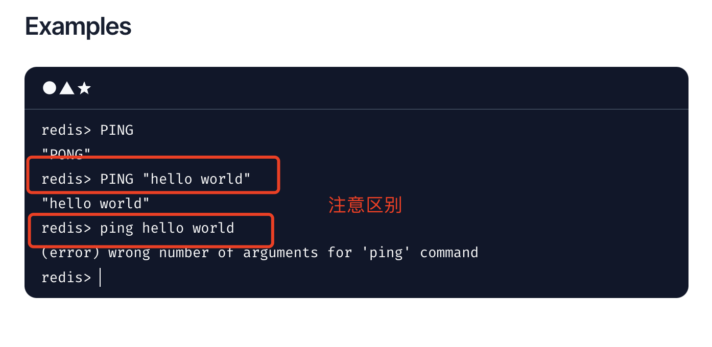
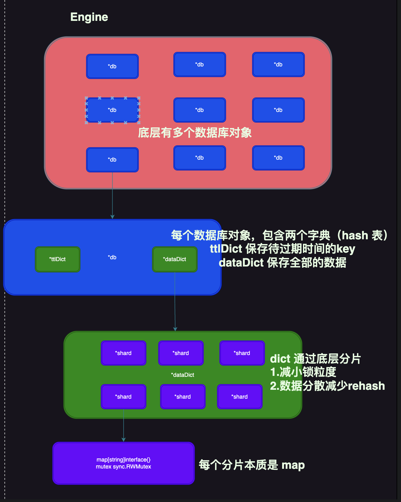

# Golang实现自己的Redis（内存数据库篇）

用11篇文章实现一个可用的Redis服务，姑且叫**EasyRedis**吧，希望通过文章将Redis掰开撕碎了呈现给大家，而不是仅仅停留在八股文的层面，并且有非常爽的感觉，欢迎持续关注学习。

项目代码地址: https://github.com/gofish2020/easyredis 欢迎Fork & Star

- [x] easyredis之TCP服务 
- [x] easyredis之网络请求序列化协议（RESP）
- [x] easyredis之内存数据库
- [ ] easyredis之过期时间 (时间轮实现)
- [ ] easyredis之持久化 （AOF实现）
- [ ] easyredis之发布订阅功能
- [ ] easyredis之有序集合（跳表实现）
- [ ] easyredis之 pipeline 客户端实现
- [ ] easyredis之事务（原子性/回滚）
- [ ] easyredis之连接池
- [ ] easyredis之分布式集群存储


## 【第三篇】EasyRedis之内存数据库篇

上篇文章已经可以解析出`Redis serialization protocol`,本篇基于解析出来的命令，进行代码处理过程：
这里以5个常用命令作为本篇文章的切入口：
命令官方文档 https://redis.io/commands 
```sh
# ping服务器
PING [message]
# 授权密码设置
AUTH <password>
# 选择数据库
SELECT index
# 设置key
SET key value [NX | XX]  [EX seconds | PX milliseconds]
# 获取key
GET key
```


### ping服务器
代码路径: `engine/engine.go`
这个功能算是小试牛刀的小功能，让大家对基本的套路有个简单的认识

```go
// redisCommand 待执行的命令  protocol.Reply 执行结果
func (e *Engine) Exec(c *connection.KeepConnection, redisCommand [][]byte) (result protocol.Reply) {

	 //... 省略...

	commandName := strings.ToLower(string(redisCommand[0]))
	if commandName == "ping" { // https://redis.io/commands/ping/
		return Ping(redisCommand[1:])
	}
	 //... 省略...
}


```
`Exec`函数就是进行命令处理的总入口函数，通过从协议中解析出来的`redisCommand`，我们可以提取出命令名`commandName`变量，然后在`Ping(redisCommand[1:])`函数中进行逻辑处理。
```go

func Ping(redisArgs [][]byte) protocol.Reply {

	if len(redisArgs) == 0 { // 不带参数
		return protocol.NewPONGReply()
	} else if len(redisArgs) == 1 { // 带参数1个
		return protocol.NewBulkReply(redisArgs[0])
	}
    // 否则，回复命令格式错误
	return protocol.NewArgNumErrReply("ping")
}
```
`Ping`函数的本质就是基于`PING [message]`这个`redis`命令的基本格式，进行不同的数据响应。这里建议大家看下Ping命令的文档 https://redis.io/commands/ping/


以上图为例
- 如果是直接的`PING`命令，后面不带参数，我们要回复`PONG`
- 如果带参`"Hello world"`，我们原样回复`Hello world`
- 如果带了两个参数`hello`和`world`,直接回复错误。

有了这个处理套路，那么其他的命令也可依葫芦画瓢了。

### 授权密码设置
启动`redis`服务的时候，如果有设定需要密码，那么客户端连接上来以后，需要先执行一次 `Auth password`的授权命令

```go
// redisCommand 待执行的命令  protocol.Reply 执行结果
func (e *Engine) Exec(c *connection.KeepConnection, redisCommand [][]byte) (result protocol.Reply) {

	//... 省略...
	commandName := strings.ToLower(string(redisCommand[0]))
	if commandName == "auth" {
		return Auth(c, redisCommand[1:])
	}
	// 校验密码
	if !checkPasswd(c) {
		return protocol.NewGenericErrReply("Authentication required")
	}

	//... 省略...
}
```

服务器接收到命令后，依据`commandName`的变量值为`auth`，则执行 `Auth(c, redisCommand[1:])`函数

```go
func Auth(c *connection.KeepConnection, redisArgs [][]byte) protocol.Reply {
	if len(redisArgs) != 1 {
		return protocol.NewArgNumErrReply("auth")
	}

	if conf.GlobalConfig.RequirePass == "" {
		return protocol.NewGenericErrReply("No authorization is required")
	}

	password := string(redisArgs[0])
	if conf.GlobalConfig.RequirePass != password {
		return protocol.NewGenericErrReply("Auth failed, password is wrong")
	}

	c.SetPassword(password)
	return protocol.NewOkReply()
}
```
这里的解析过程我们是按照 `AUTH <password>`这个命令格式进行解析，解析出来密码以后，我们需要将密码保存在**c *connection.KeepConnection**对象的成员变量中。这里就类似`session`的原理，存储以后，当前连接接下来的命令就不需要继续带上密码了。在每次处理其他命令之前，校验下当前连接的密码是否有效：
```go
func checkPasswd(c *connection.KeepConnection) bool {
	// 如果没有配置密码
	if conf.GlobalConfig.RequirePass == "" {
		return true
	}
	// 密码是否一致
	return c.GetPassword() == conf.GlobalConfig.RequirePass
}
```


### 选择数据库
这个命令虽然用的比较少，但是这个涉及到服务端结构的设计。`redis`的服务端是支持多个数据库，每个数据库就是一个`CRUD`的基本存储单元，不同的数据库(存储单元)之间的数据是不共享的。默认情况下，我们使用的都是`select 0`数据库。

**代码结构如下图：（这个图很重要，配合代码好好理解下）**


我们需要在`Engine`结构体中创建多个 `*DB`对象
```go
func NewEngine() *Engine {

	engine := &Engine{}
	// 多个dbSet
	engine.dbSet = make([]*atomic.Value, conf.GlobalConfig.Databases)
	for i := 0; i < conf.GlobalConfig.Databases; i++ {
		// 创建 *db
		db := newDB()
		db.SetIndex(i)
		// 保存到 atomic.Value中
		dbset := &atomic.Value{}
		dbset.Store(db)
		// 赋值到 dbSet中
		engine.dbSet[i] = dbset
	}

	return engine
}
```
在用户端发送来 `select index` 命令，服务端需要记录下来**当前连接**选中的数据库索引
```go
// redisCommand 待执行的命令  protocol.Reply 执行结果
func (e *Engine) Exec(c *connection.KeepConnection, redisCommand [][]byte) (result protocol.Reply) {

	//....忽略....

	// 基础命令
	switch commandName {
	case "select": // 表示当前连接，要选中哪个db https://redis.io/commands/select/
		return execSelect(c, redisCommand[1:])
	}

	//....忽略....
}

// 这里会对 选中的索引 越界的判断，如果一切都正常，就保存到 c *connection.KeepConnection 连接的成员变量 index
func execSelect(c *connection.KeepConnection, redisArgs [][]byte) protocol.Reply {
	if len(redisArgs) != 1 {
		return protocol.NewArgNumErrReply("select")
	}
	dbIndex, err := strconv.ParseInt(string(redisArgs[0]), 10, 64)
	if err != nil {
		return protocol.NewGenericErrReply("invaild db index")
	}
	if dbIndex < 0 || dbIndex >= int64(conf.GlobalConfig.Databases) {
		return protocol.NewGenericErrReply("db index out of range")
	}
	c.SetDBIndex(int(dbIndex))
	return protocol.NewOkReply()

}
```

### 设置key
在用户要求执行 `set key value`命令的时候，我们需要先选中执行功能`*DB`对象，就是上面的`select index`命令要求选中的对象，默认是`0`号

```go

// redisCommand 待执行的命令  protocol.Reply 执行结果
func (e *Engine) Exec(c *connection.KeepConnection, redisCommand [][]byte) (result protocol.Reply) {

	//....忽略....

	// redis 命令处理
	dbIndex := c.GetDBIndex()
	logger.Debugf("db index:%d", dbIndex)
	db, errReply := e.selectDB(dbIndex)
	if errReply != nil {
		return errReply
	}
	return db.Exec(c, redisCommand)
}
```
可以看到，最终代码执行`execNormalCommand`函数，该函数会从命令注册中心获取命令的执行函数

```go
func (db *DB) Exec(c *connection.KeepConnection, redisCommand [][]byte) protocol.Reply {

	return db.execNormalCommand(c, redisCommand)
}

func (db *DB) execNormalCommand(c *connection.KeepConnection, redisCommand [][]byte) protocol.Reply {

	cmdName := strings.ToLower(string(redisCommand[0]))

	// 从命令注册中心，获取命令的执行函数
	command, ok := commandCenter[cmdName]
	if !ok {
		return protocol.NewGenericErrReply("unknown command '" + cmdName + "'")
	}
	fun := command.execFunc
	return fun(db, redisCommand[1:])
}

```

最终 `set`命令的实际执行函数代码路径为`engine/string.go`中的`func cmdSet(db *DB, args [][]byte) protocol.Reply`函数。代码的的本质其实还是解析字符串，按照官方文档https://redis.io/commands/set/ 要求的格式获取对应的参数，执行数据的存储`db.PutEntity(key, &entity)`。
```go
func (db *DB) PutEntity(key string, entity *payload.DataEntity) int {
	return db.dataDict.Put(key, entity)
}
```
`dataDict`是`*ConcurrentDict`类型的并发安全的字典

```go
// 并发安全的字典
type ConcurrentDict struct {
	shds  []*shard      // 底层shard切片
	mask  uint32        // 掩码
	count *atomic.Int32 // 元素个数
}
```
`ConcurrentDict`通过分片的模式，将数据分散在不同的`*shard`对象中,`shard`的本质就是`map`+读写锁`mu`

```go
type shard struct {
	m  map[string]interface{}
	mu sync.RWMutex
}
```
所以内存数据库的本质就是操作`map`
- key就是`set`命令的`key`
- `value`我们额外包装了一个`DataEntity`对象，将实际的值保存在 `RedisObject`

```go
type DataEntity struct {
	RedisObject interface{} // 字符串 跳表 链表 quicklist 集合 etc...
}
```

代码中已经注释的很清晰，建议直接看代码


### 获取key

代码只是额外多调用了几层函数，本质就是调用`db.dataDict.Get(key)` 函数，其实又是`*ConcurrentDict`,代码可能感觉有点绕，把上面的**代码结构图**好好理解一下。

```go
func cmdGet(db *DB, args [][]byte) protocol.Reply {
	if len(args) != 1 {
		return protocol.NewSyntaxErrReply()
	}

	key := string(args[0])
	bytes, reply := db.getStringObject(key)
	if reply != nil {
		return reply
	}
	return protocol.NewBulkReply(bytes)
}

// 获取底层存储对象【字节流】
func (db *DB) getStringObject(key string) ([]byte, protocol.Reply) {
	payload, exist := db.GetEntity(key)
	if !exist {
		return nil, protocol.NewNullBulkReply()
	}
	// 判断底层对象是否为【字节流】
	bytes, ok := payload.RedisObject.([]byte)
	if !ok {
		return nil, protocol.NewWrongTypeErrReply()
	}
	return bytes, nil
}

// 获取内存中的数据
func (db *DB) GetEntity(key string) (*payload.DataEntity, bool) {

	// key 不存在
	val, exist := db.dataDict.Get(key)
	if !exist {
		return nil, false
	}

	dataEntity, ok := val.(*payload.DataEntity)
	if !ok {
		return nil, false
	}
	return dataEntity, true
}
```


### 效果演示

