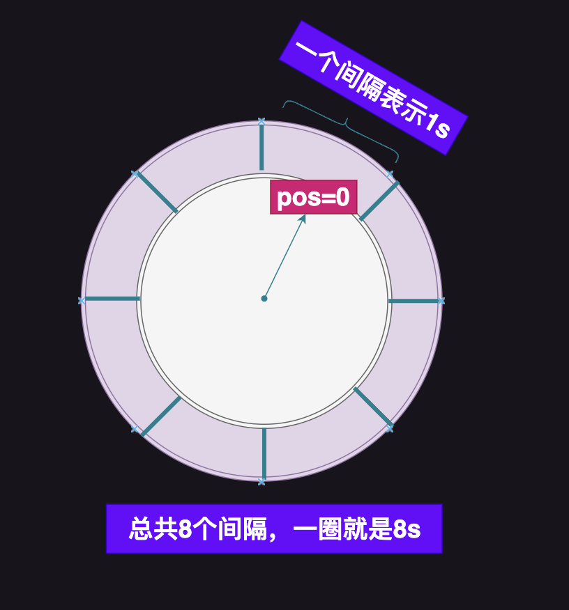
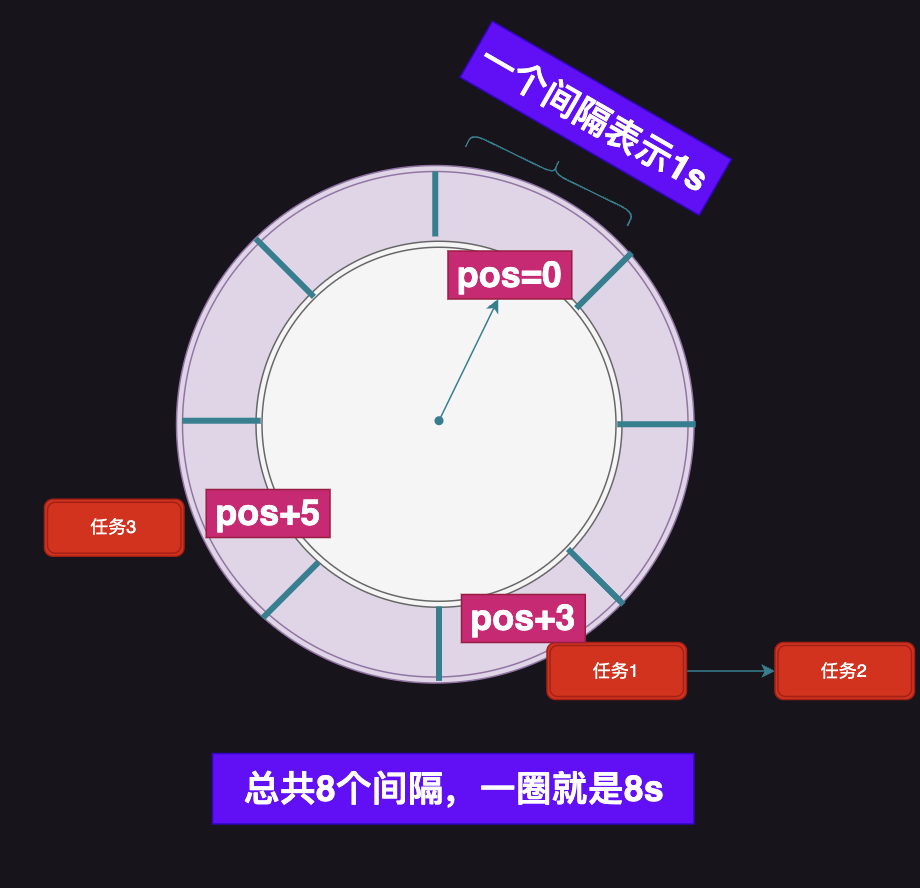
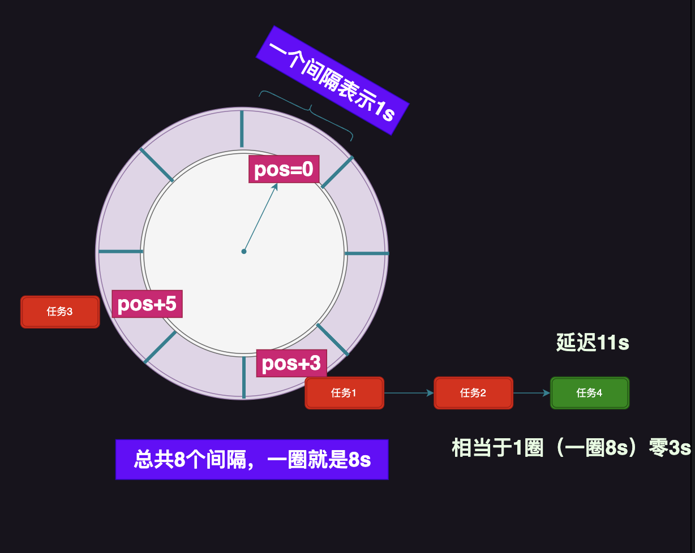
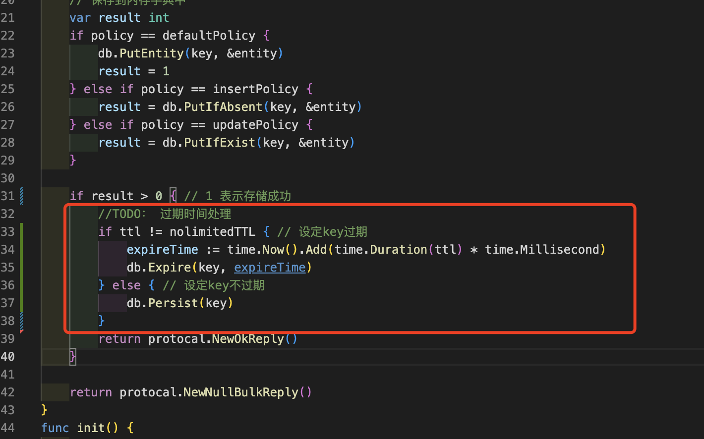

# Golang实现自己的Redis（过期时间）

用11篇文章实现一个可用的Redis服务，姑且叫**EasyRedis**吧，希望通过文章将Redis掰开撕碎了呈现给大家，而不是仅仅停留在八股文的层面，并且有非常爽的感觉，欢迎持续关注学习。

项目代码地址: https://github.com/gofish2020/easyredis 欢迎Fork & Star

- [x] easyredis之TCP服务 
- [x] easyredis之网络请求序列化协议（RESP）
- [x] easyredis之内存数据库
- [x] easyredis之过期时间 (时间轮实现)
- [ ] easyredis之持久化 （AOF实现）
- [ ] easyredis之发布订阅功能
- [ ] easyredis之有序集合（跳表实现）
- [ ] easyredis之 pipeline 客户端实现
- [ ] easyredis之事务（原子性/回滚）
- [ ] easyredis之连接池
- [ ] easyredis之分布式集群存储


## 【第四篇】EasyRedis之过期时间

在使用`Redis`的时候经常会对缓存设定过期时间，例如`set key value ex 3`,设定过期时间`3s`,等到过期以后，我们再执行`get key`正常情况下是得不到数据的。不同的key会设定不同的过期时间`1s 5s 2s`等等。按照八股文我们知道`key`过期的时候，有两种删除策略：
- 惰性删除：不主动删除过期key，当访问该key的时候，如果发现过期了再删除
好处：对CPU友好，不用频繁执行删除，但是对内存不友好，都过期了还占用内存
- 定时删除：主动删除key，到了key的过期时间，立即执行删除
好处：对内存友好，可以缓解内存压力，对CPU不友好，需要频繁的执行删除

所以redis就把两种策略都实现了,我们看下代码如何使下？


### 惰性删除
本质就是访问的时候判断下key是否过期，过期就删除并返回空。
代码路径`engine/database.go`
在获取key的值时候，我们会执行一次 `db.IsExpire(key)`判断key是否过期
```go
func (db *DB) GetEntity(key string) (*payload.DataEntity, bool) {

	// key 不存在
	val, exist := db.dataDict.Get(key)
	if !exist {
		return nil, false
	}
	// key是否过期（主动检测一次）
	if db.IsExpire(key) {
		return nil, false
	}
	// 返回内存数据
	dataEntity, ok := val.(*payload.DataEntity)
	if !ok {
		return nil, false
	}
	return dataEntity, true
}
```
就是从过期字典`ttlDict`中获取key的过期时间
- 如果没有获取到，说明没有设定过期时间（do nothing）
- 如果有过期时间，并且时间已经过期，主动删除之

```go
// 判断key是否已过期
func (db *DB) IsExpire(key string) bool {
	val, result := db.ttlDict.Get(key)
	if !result {
		return false
	}
	expireTime, _ := val.(time.Time)
	isExpire := time.Now().After(expireTime)
	if isExpire { // 如果过期，主动删除
		db.Remove(key)
	}
	return isExpire
}

```

### 定时删除

本质是对key设定一个过期时间，时间一到立即执行删除的任务。
正常的思路肯定是设定一个固定的定时器，例如`3s`检测一次，这种思路可以，但是存在一个问题，
- 如果key的过期时间为`1s`，那你`3s`才检测是否太不够及时了？
- 那就把检测间隔设定为`1s`吧，那如果`key`的过期时间都为`3s`，到执行时间检测一遍发现任务都没过期，那不就白白浪费CPU时间了吗？

这就要推出我们的时间轮算法了，时间轮算法就是在模拟现实世界**钟表**的原理



- 我想里面增加2个3s的任务，那就将任务添加到距离当前位置`pos + 3`的位置
- 同时再加1个5s的任务，那就将任务添加到距离当前位置`pos + 5`的位置


当钟表的指针指向`pos + 3`的位置，就执行**任务链表**的任务即可。
因为钟表是循环往复的运行，那如果我再添加11s的任务，可以发现该任务也是放置到 `pos+3`的位置，那任务就要区分下，到底是3s的任务还是11s的任务


所以里面又有了一个`circle`的标记，表示当前任务是第几圈的任务


代码路径`tool/timewheel`

代码中通过切片模型环，通过链表模拟任务链表
```go
// 循环队列 + 链表
type TimeWheel struct {

	// 间隔
	interval time.Duration
	// 定时器
	ticker *time.Ticker

	// 游标
	curSlotPos int
	// 循环队列大小
	slotNum int
	// 底层存储
	slots []*list.List
	m     map[string]*taskPos

	// 任务通道
	addChannel   chan *task
	cacelChannel chan string
	// 停止
	stopChannel chan struct{}
}

```

当添加任务的时候，需要通过延迟时间计算当前任务的圈数`circle`

```go

func (tw *TimeWheel) posAndCircle(d time.Duration) (pos, circle int) {

	// 延迟(秒)
	delaySecond := int(d.Seconds())
	// 间隔(秒)
	intervalSecond := int(tw.interval.Seconds())
	// delaySecond/intervalSecond 表示从curSlotPos位置偏移
	pos = (tw.curSlotPos + delaySecond/intervalSecond) % tw.slotNum
	circle = (delaySecond / intervalSecond) / tw.slotNum
	return
}

func (tw *TimeWheel) addTask(t *task) {

	// 定位任务应该保存在循环队列的位置 & 圈数
	pos, circle := tw.posAndCircle(t.delay)
	t.circle = circle

	// 将任务保存到循环队列pos位置
	ele := tw.slots[pos].PushBack(t)
	// 在map中记录 key -> { pos, ele } 的映射
	if t.key != "" {
		// 已经存在重复的key
		if _, ok := tw.m[t.key]; ok {
			tw.cancelTask(t.key)
		}
		tw.m[t.key] = &taskPos{pos: pos, ele: ele}
	}
}

```
代码中注释的很清晰，也就**100多行**建议看代码结合上图体会下（很简单）

### 额外补充

我们在执行`set key value ex 3`的时候，先设定过期时间为3s，但是在1s的时候，我们又执行了`set key value`,请问key还会过期吗？？

答案：不会过期了。相当于对key去掉了过期时间。所以在代码处理中，我们需要考虑这种情况，重复设定的问题


代码细节位于`engine/string.go` set命令处理函数`func cmdSet(db *DB, args [][]byte) protocol.Reply `的尾部位置
