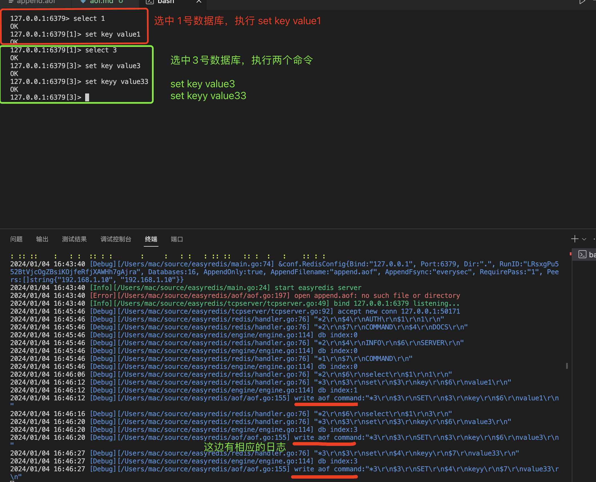
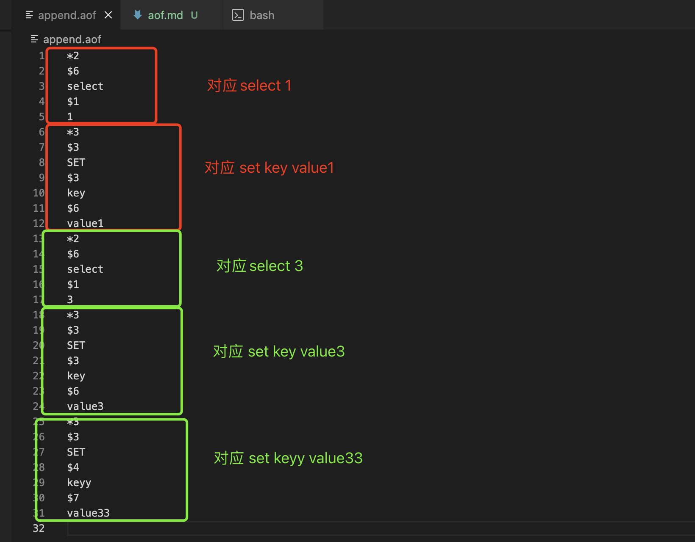
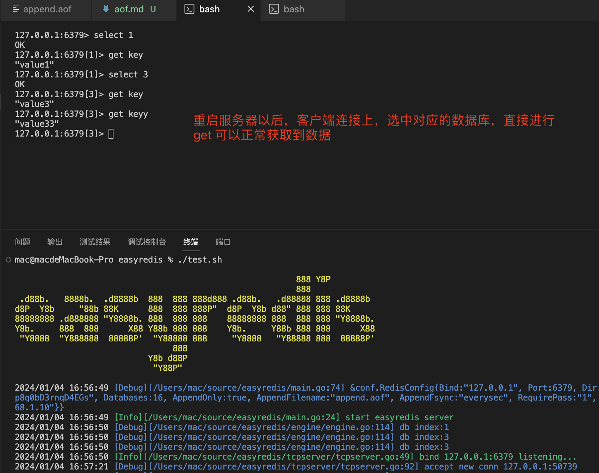
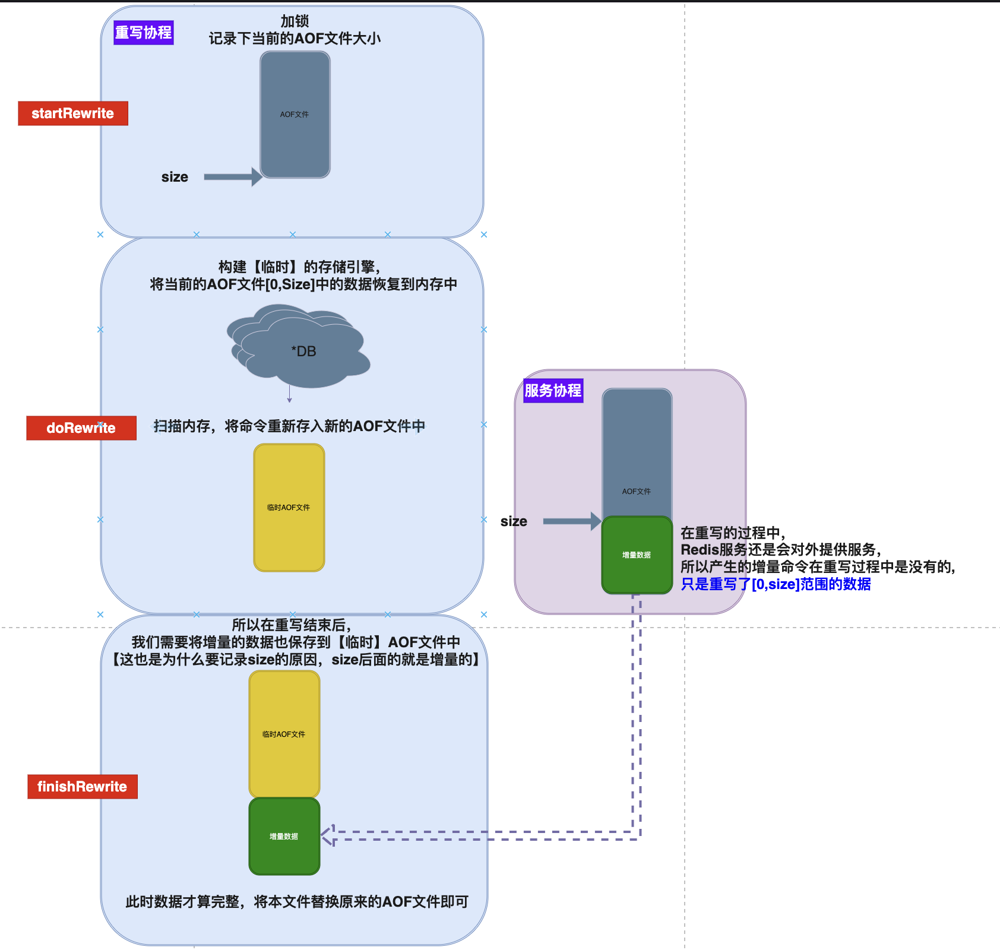

# Golang实现自己的Redis(持久化AOF)

用11篇文章实现一个可用的Redis服务，姑且叫**EasyRedis**吧，希望通过文章将Redis掰开撕碎了呈现给大家，而不是仅仅停留在八股文的层面，并且有非常爽的感觉，欢迎持续关注学习。

项目代码地址: https://github.com/gofish2020/easyredis 欢迎Fork & Star

- [x] easyredis之TCP服务 
- [x] easyredis之网络请求序列化协议（RESP）
- [x] easyredis之内存数据库
- [x] easyredis之过期时间 (时间轮实现)
- [x] easyredis之持久化 （AOF实现）
- [ ] easyredis之发布订阅功能
- [ ] easyredis之有序集合（跳表实现）
- [ ] easyredis之 pipeline 客户端实现
- [ ] easyredis之事务（原子性/回滚）
- [ ] easyredis之连接池
- [ ] easyredis之分布式集群存储


## 【第五篇】EasyRedis之持久化AOF

`AOF`全称`Append Only File`，就是将**写相关的命令**，追加保存到文件中，当服务器重启以后，将文件中的命令在服务端重放（重新执行恢复数据），实现的一种持久化方式。

本篇通过3个部分讲解AOF的实现：
- AOF的写入过程
- AOF的加载过程
- AOF的重写过程


### AOF的写入过程

在核心的数据结构 `Engine`中新增一个 `aof *AOF`对象

```go
// 存储引擎，负责数据的CRUD
type Engine struct {
	// *DB
	dbSet []*atomic.Value
	// 时间轮(延迟任务)
	delay *timewheel.Delay
	// Append Only File
	aof *aof.AOF
}
```
在初始化函数`func NewEngine() *Engine`中，会基于是否启用AOF日志，决定 `aof *aof.AOF`的初始化

```go
func NewEngine() *Engine {

	//.....省略....

	// 启用AOF日志
	if conf.GlobalConfig.AppendOnly {
		// 创建*AOF对象
		aof, err := aof.NewAOF(conf.GlobalConfig.AppendFilename, engine, true, conf.GlobalConfig.AppendFsync)
		if err != nil {
			panic(err)
		}
		engine.aof = aof
		// 设定每个db，使用aof写入日志
		engine.aofBindEveryDB()
	}
	return engine
}

```
因为实际执行`redis`命令的对象是 `*DB`，所以会对每个`*DB`对象设定`db.writeAof`函数指针
```go

func (e *Engine) aofBindEveryDB() {
	for _, dbSet := range e.dbSet {
		db := dbSet.Load().(*DB)
		db.writeAof = func(redisCommand [][]byte) {
			if conf.GlobalConfig.AppendOnly {
                // 调用e.aof对象方法，保存命令
				e.aof.SaveRedisCommand(db.index, aof.Command(redisCommand))
			}
		}
	}
}


```
例如，当我们执行 `set key value`命令的时候，实际会执行 `func cmdSet(db *DB, args [][]byte) protocol.Reply`

```go

func cmdSet(db *DB, args [][]byte) protocol.Reply {
	
    //.....省略....

	if result > 0 { // 1 表示存储成功
		//TODO： 过期时间处理
		if ttl != nolimitedTTL { // 设定key过期
			expireTime := time.Now().Add(time.Duration(ttl) * time.Millisecond)
			db.ExpireAt(key, expireTime)
			//写入日志
			db.writeAof(aof.SetCmd([][]byte{args[0], args[1]}...))
			db.writeAof(aof.PExpireAtCmd(string(args[0]), expireTime))
		} else { // 设定key不过期
			db.Persist(key)
			//写入日志
			db.writeAof(aof.SetCmd(args...))
		}
		return protocol.NewOkReply()
	}

	return protocol.NewNullBulkReply()
}

```
可以看到，会调用上面刚才设定的`db.writeAof`函数，将当前的命令保存到AOF中。所以我们实际看下 `SaveRedisCommand`函数中具体在做什么事情。代码路径位于`aof/aof.go`

```go
func (aof *AOF) SaveRedisCommand(dbIndex int, command Command) {

	// 关闭
	if aof.atomicClose.Load() {
		return
	}
	// 写入文件 & 刷盘
	if aof.aofFsync == FsyncAlways {
		record := aofRecord{
			dbIndex: dbIndex,
			command: command,
		}
		aof.writeAofRecord(record)
		return
	}
	// 写入缓冲
	aof.aofChan <- aofRecord{
		dbIndex: dbIndex,
		command: command,
	}
}
```
因为AOF的刷盘（Sync）有三种模式：
- 写入 & 立即刷盘
- 写入 & 每秒刷盘
- 写入 & 不主动刷盘（取决于操作系统自动刷盘）

如果配置的是`always`模式，会立即执行`aof.writeAofRecord(record)`;否则就将数据先保存在缓冲`aof.aofChan`中（这里其实又是**生产者消费者模型**）最后在消费协程中，执行写入
```go
func (aof *AOF) watchChan() {

	for record := range aof.aofChan {
		aof.writeAofRecord(record)
	}
	aof.aofFinished <- struct{}{}
}

```

所以我们只需要看下 `writeAofRecord`函数即可,其实就是把命令按照`Redis 序列化协议`的格式，写入到文件中。给大家看下更直观的演示图：


再看下在 `append.aof`文件中具体的数据格式：


这里有个很重要点：因为AOF文件是所有的`*DB`对象复用的文件，写入的redis命令归属于不同的数据库的

举个例子：
比如在0号数据库，我们执行`set key value`,在3号数据库，我们执行`set key value`,在日志文件中会记录两条命令，但是这两个命令其实是不同数据库的命令。在恢复命令到数据库的时候，应该在不同的数据库中执行该命令。所以在记录命令的时候，我们还要记录下他的数据库是什么？这样恢复的时候，才能知道命令的数据库的归属问题。

```go

func (aof *AOF) writeAofRecord(record aofRecord) {

	aof.mu.Lock()
	defer aof.mu.Unlock()

	// 因为aof对象是所有数据库对象【复用】写入文件方法，每个数据库的索引不同
	// 所以，每个命令的执行，有个前提就是操作的不同的数据库
	if record.dbIndex != aof.lastDBIndex {
		// 构建select index 命令 & 写入文件
		selectCommand := [][]byte{[]byte("select"), []byte(strconv.Itoa(record.dbIndex))}
		data := protocol.NewMultiBulkReply(selectCommand).ToBytes()
		_, err := aof.aofFile.Write(data)
		if err != nil {
			logger.Warn(err)
			return
		}
		aof.lastDBIndex = record.dbIndex
	}

	// redis命令
	data := protocol.NewMultiBulkReply(record.command).ToBytes()
	_, err := aof.aofFile.Write(data)
	if err != nil {
		logger.Warn(err)
	}
	logger.Debugf("write aof command:%q", data)
	// 每次写入刷盘
	if aof.aofFsync == FsyncAlways {
		aof.aofFile.Sync()
	}
}

```


### AOF的加载过程

在服务启动的时候，将`*.aof`文件中的命令，在服务端进行重放，效果演示如下：


代码路径位于`aof/aof.go`
```go
// 构建AOF对象
func NewAOF(aofFileName string, engine abstract.Engine, load bool, fsync string) (*AOF, error) {
	//...省略...

	// 启动加载aof文件
	if load {
		aof.LoadAof(0)
	}


    //...省略...
}
```

`aof.LoadAof(0)`函数的本质就是从文件中，按照行读取数据。如果看过之前的文章，这里其实复用了`parser.ParseStream(reader)`函数，负责从文件解析`redis序列化协议`格式的命令，最后利用数据库引擎，将命令数据保存到内存中（命令重放）

```go
func (aof *AOF) LoadAof(maxBytes int) {

	// 目的：当加载aof文件的时候，因为需要复用engine对象，内部重放命令的时候会自动写aof日志，加载aof 禁用 SaveRedisCommand的写入
	aof.atomicClose.Store(true)
	defer func() {
		aof.atomicClose.Store(false)
	}()

	// 只读打开文件
	file, err := os.Open(aof.aofFileName)
	if err != nil {
		logger.Error(err.Error())
		return
	}
	defer file.Close()
	file.Seek(0, io.SeekStart)

	var reader io.Reader
	if maxBytes > 0 { // 限定读取的字节大小
		reader = io.LimitReader(file, int64(maxBytes))
	} else { // 不限定，直接读取到文件结尾（为止）
		reader = file
	}

	// 文件中保存的格式和网络传输的格式一致
	ch := parser.ParseStream(reader)
	virtualConn := connection.NewVirtualConn()

	for payload := range ch {
		if payload.Err != nil {
			// 文件已经读取到“完成“
			if payload.Err == io.EOF {
				break
			}
			// 读取到非法的格式
			logger.Errorf("LoadAof parser error %+v:", payload.Err)
			continue
		}

		if payload.Reply == nil {
			logger.Error("empty payload data")
			continue
		}
		// 从文件中读取到命令
		reply, ok := payload.Reply.(*protocol.MultiBulkReply)
		if !ok {
			logger.Error("require multi bulk protocol")
			continue
		}

		// 利用数据库引擎，将命令数据保存到内存中（命令重放）
		ret := aof.engine.Exec(virtualConn, reply.RedisCommand)
		// 判断是否执行失败
		if protocol.IsErrReply(ret) {
			logger.Error("exec err ", string(ret.ToBytes()))
		}
		// 判断命令是否是"select"
		if strings.ToLower(string(reply.RedisCommand[0])) == "select" {
			dbIndex, err := strconv.Atoi(string(reply.RedisCommand[1]))
			if err == nil {
				aof.lastDBIndex = dbIndex // 记录下数据恢复过程中，选中的数据库索引
			}
		}
	}
}
```


### AOF的重写过程
代码路径`aof/rewrite.go`
重写的过程就是下面的函数
```go
func (aof *AOF) Rewrite(engine abstract.Engine) {
	//1.对现有的aof文件做一次快照
	snapShot, err := aof.startRewrite()
	if err != nil {
		logger.Errorf("StartRewrite err: %+v", err)
		return
	}

	//2. 将现在的aof文件数据，加在到新（内存）对象中,并重写入新aof文件中
	err = aof.doRewrite(snapShot, engine)
	if err != nil {
		logger.Errorf("doRewrite err: %+v", err)
		return
	}

	//3. 将重写过程中的增量命令写入到新文件中
	err = aof.finishRewrite(snapShot)
	if err != nil {
		logger.Errorf("finishRewrite err: %+v", err)
	}
}
```
整个的处理思想很重要：如下图




### 总结

代码的思路应该还是比较清晰，但是细节上的处理非常容易让人大脑宕机。建议还是看下源码，边看边自己敲一下，感受是不一样的