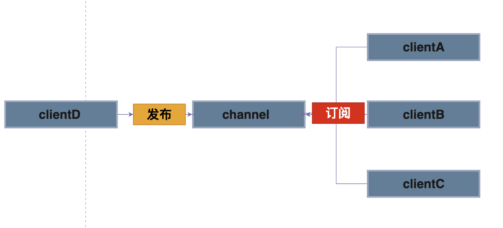
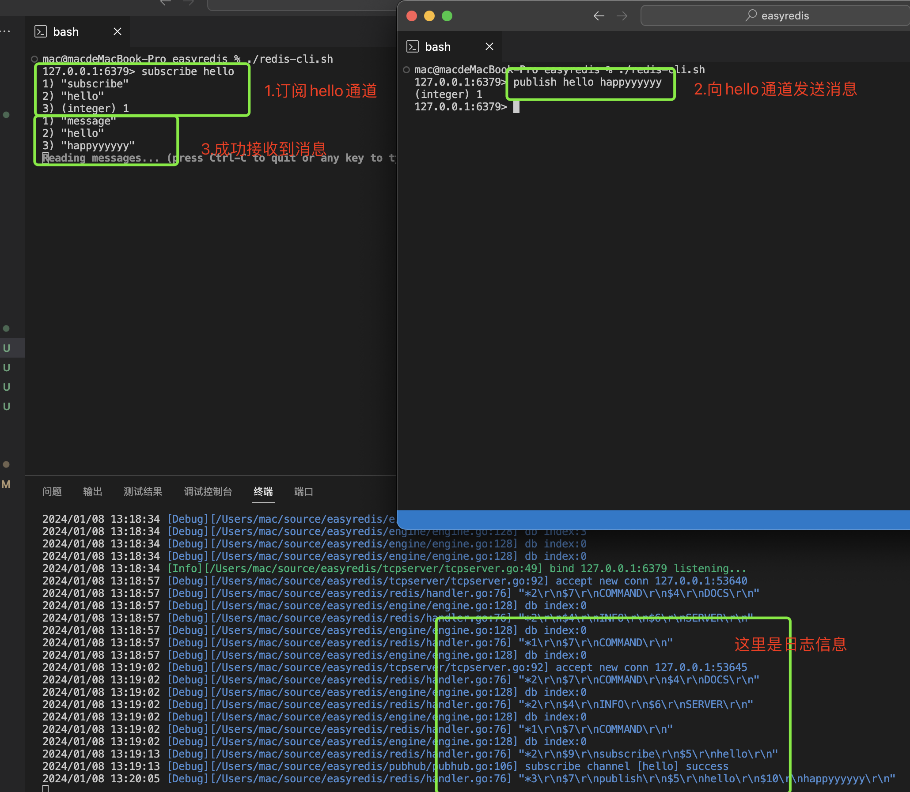
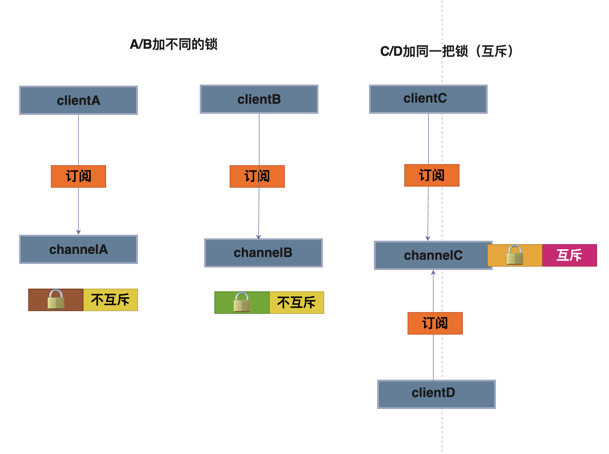
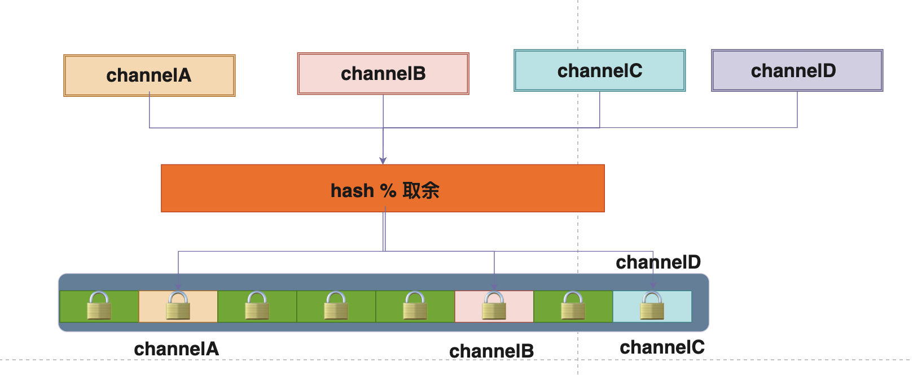

# Golang实现自己的Redis(发布订阅功能)

用11篇文章实现一个可用的Redis服务，姑且叫**EasyRedis**吧，希望通过文章将Redis掰开撕碎了呈现给大家，而不是仅仅停留在八股文的层面，并且有非常爽的感觉，欢迎持续关注学习。

项目代码地址: https://github.com/gofish2020/easyredis 欢迎Fork & Star

- [x] easyredis之TCP服务 
- [x] easyredis之网络请求序列化协议（RESP）
- [x] easyredis之内存数据库
- [x] easyredis之过期时间 (时间轮实现)
- [x] easyredis之持久化 （AOF实现）
- [x] easyredis之发布订阅功能
- [ ] easyredis之有序集合（跳表实现）
- [ ] easyredis之 pipeline 客户端实现
- [ ] easyredis之事务（原子性/回滚）
- [ ] easyredis之连接池
- [ ] easyredis之分布式集群存储

## 【第六篇】EasyRedis之发布订阅

代码路径： `pubhub/pubhub.go`这个代码很简单，总共就**200行**

发布订阅的基本原理：客户端A/B/C订阅通道，客户端D往通道中发送消息后，客户端A/B/C可以接收到通道中的消息



**效果演示**:



底层实现的数据结构采用`map + list`，map中的`key`表示channel，value则用list来存储同一个channel下的多个客户端`clientN`

```go

type Pubhub struct {

	// 自定义实现的map
	dataDict dict.ConcurrentDict

	// 该锁的颗粒度太大
	//locker sync.RWMutex

	locker *locker.Locker // 自定义一个分布锁
}
```
- `dataDict`就是我们自己实现的`map`
- `locker` 用来对操作**同一个链表**的不同客户端加锁，避免并发问题


### 订阅Subscribe

- 获取客户端发送来的通道名
- 加锁（锁的原理看文章最后）
- 遍历通道，获取该通道下的客户端链表
- 将当前的客户端加入到链表中即可(前提：没有订阅过)

```go
// SUBSCRIBE channel [channel ...]
func (p *Pubhub) Subscribe(c abstract.Connection, args [][]byte) protocol.Reply {

	if len(args) < 1 {
		return protocol.NewArgNumErrReply("subscribe")
	}

	// 通道名
	keys := make([]string, 0, len(args))
	for _, arg := range args {
		keys = append(keys, string(arg))
	}
	// 加锁
	p.locker.Locks(keys...)
	defer p.locker.Unlocks(keys...)

	for _, arg := range args {
		chanName := string(arg)
		// 记录当前客户端连接订阅的通道
		c.Subscribe(chanName)

		// 双向链表，记录通道下的客户端连接
		var l *list.LinkedList
		raw, exist := p.dataDict.Get(chanName)
		if !exist { // 说明该channel第一次使用
			l = list.NewLinkedList()
			p.dataDict.Put(chanName, l)
		} else {
			l, _ = raw.(*list.LinkedList)
		}

		// 未订阅
		if !l.Contain(func(actual interface{}) bool {
			return c == actual
		}) {
			// 如果不重复，那就记录订阅
			logger.Debug("subscribe channel [" + chanName + "] success")
			l.Add(c)
		}

		// 回复客户端消息
		_, err := c.Write(channelMsg(_subscribe, chanName, c.SubCount()))
		if err != nil {
			logger.Warn(err)
		}
	}

	return protocol.NewNoReply()
}
```

### 取消订阅 Unsubscribe

-  获取通道名（如果没有指定，就是取消当前客户端的所有通道）
-  加锁（锁的原理看文章最后）
-  获取该通道下的客户端链表
-  从链表中删除当前的客户端

```go
// 取消订阅
// unsubscribes itself from all the channels using the UNSUBSCRIBE command without additional arguments
func (p *Pubhub) Unsubscribe(c abstract.Connection, args [][]byte) protocol.Reply {

	var channels []string
	if len(args) < 1 { // 取消全部
		channels = c.GetChannels()
	} else { // 取消指定channel
		channels = make([]string, len(args))
		for i, v := range args {
			channels[i] = string(v)
		}
	}

	p.locker.Locks(channels...)
	defer p.locker.Unlocks(channels...)

	// 说明已经没有订阅的通道
	if len(channels) == 0 {
		c.Write(noChannelMsg())
	}
	for _, channel := range channels {

		// 从客户端中删除当前通道
		c.Unsubscribe(channel)
		// 获取链表
		raw, ok := p.dataDict.Get(channel)
		if ok {
			// 从链表中删除当前客户端
			l, _ := raw.(*list.LinkedList)
			l.DelAllByVal(func(actual interface{}) bool {
				return c == actual
			})

			// 如果链表为空，清理map
			if l.Len() == 0 {
				p.dataDict.Delete(channel)
			}
		}
		c.Write(channelMsg(_unsubscribe, channel, c.SubCount()))
	}

	return protocol.NewNoReply()
}
```

### 发布 publish

- 获取客户端的channel
- 从map将channel作为key得到客户端链表
- 对链表的所有客户端发送数据即可

```go

func (p *Pubhub) Publish(self abstract.Connection, args [][]byte) protocol.Reply {

	if len(args) != 2 {
		return protocol.NewArgNumErrReply("publish")
	}

	channelName := string(args[0])
	// 加锁
	p.locker.Locks(channelName)
	defer p.locker.Unlocks(channelName)

	raw, ok := p.dataDict.Get(channelName)
	if ok {

		var sendSuccess int64
		var failedClient = make(map[interface{}]struct{})
		// 取出链表
		l, _ := raw.(*list.LinkedList)
		// 遍历链表
		l.ForEach(func(i int, val interface{}) bool {

			conn, _ := val.(abstract.Connection)

			if conn.IsClosed() {
				failedClient[val] = struct{}{}
				return true
			}

			if val == self { //不给自己发送
				return true
			}
			// 发送数据
			conn.Write(publisMsg(channelName, string(args[1])))
			sendSuccess++
			return true
		})

		// 剔除客户端
		if len(failedClient) > 0 {
			removed := l.DelAllByVal(func(actual interface{}) bool {
				_, ok := failedClient[actual]
				return ok
			})
			logger.Debugf("del %d closed client", removed)
		}

		// 返回发送的客户端数量
		return protocol.NewIntegerReply(sendSuccess)
	}
	// 如果channel不存在
	return protocol.NewIntegerReply(0)
}

```


### 锁的原理
代码路径 `tool/locker/locker.go`

```go
type Pubhub struct {

	// 自定义实现的map
	dataDict dict.ConcurrentDict

	// 该锁的颗粒度太大
	//locker sync.RWMutex

	locker *locker.Locker // 自定义一个分布锁
}


```

在结构体中，当有【多个客户端同时订阅不同的通道】，通过通道名，可以获取到不同的客户端**链表**，也就是不同的客户端操作不同的链表可以并行操作（只有操作同一个链表才是互斥），如果我们使用 `locker sync.RWMutex` 锁，那就是所有的客户端持有同一把锁，一个客户端只有操作完成一个链表，才能允许另一个客户端操作另外一个链表，整个操作只能是串行的。所以我们需要实现一个颗粒度更小的锁



通过不同的通道名，加不同的锁即可（尽可能的减小锁的粒度），同时为了避免死锁，并行的协程加锁的顺序要一致。所以代码中有个排序。

这里做了一个技巧，通过hash将通道名映射成不同的hash值，再通过取余，将锁固定在一个范围内（将无限多的channel名 转成 有限范围的值），所以可能存在不同的通道名取余的结果，用的同一个锁


```go

type Locker struct {
	mu []*sync.RWMutex
	mask uint32
}

// 顺序加锁(互斥)
func (l *Locker) Locks(keys ...string) {
	indexs := l.toLockIndex(keys...)
	for _, index := range indexs {
		mu := l.mu[index]
		mu.Lock()
	}
}

// 顺序解锁(互斥)
func (l *Locker) Unlocks(keys ...string) {
	indexs := l.toLockIndex(keys...)
	for _, index := range indexs {
		mu := l.mu[index]
		mu.Unlock()
	}
}

func (l *Locker) toLockIndex(keys ...string) []uint32 {

	// 将key转成 切片索引[0,mask]
	mapIndex := make(map[uint32]struct{}) // 去重
	for _, key := range keys {
		mapIndex[l.spread(utils.Fnv32(key))] = struct{}{}
	}

	indices := make([]uint32, 0, len(mapIndex))
	for k := range mapIndex {
		indices = append(indices, k)
	}
	// 对索引排序
	sort.Slice(indices, func(i, j int) bool {
		return indices[i] < indices[j]
	})
	return indices
}

```

### 总结
锁相关的代码很有实践意义，建议大家自己的手动敲一下，平时工作中作为自己的代码小组件使用，绝对可以让人眼前一亮。