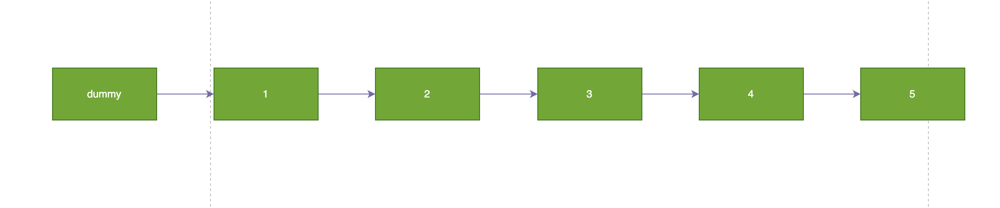
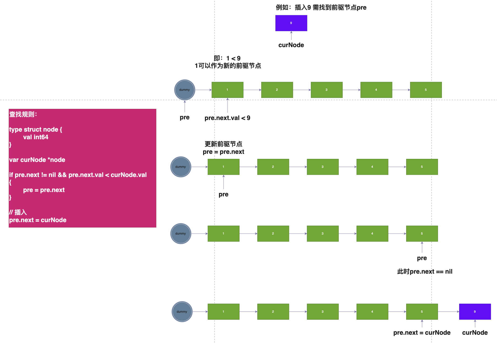
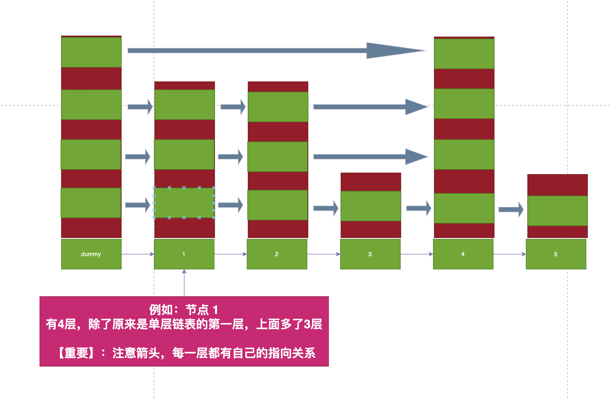
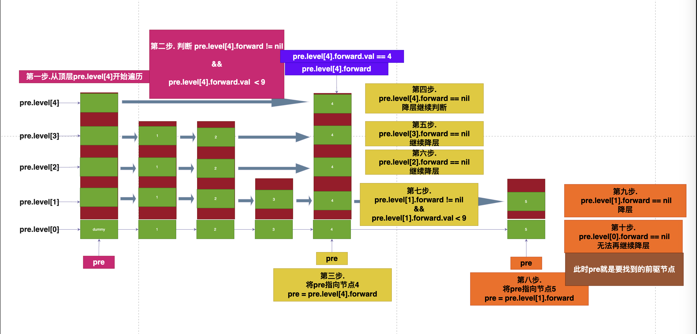
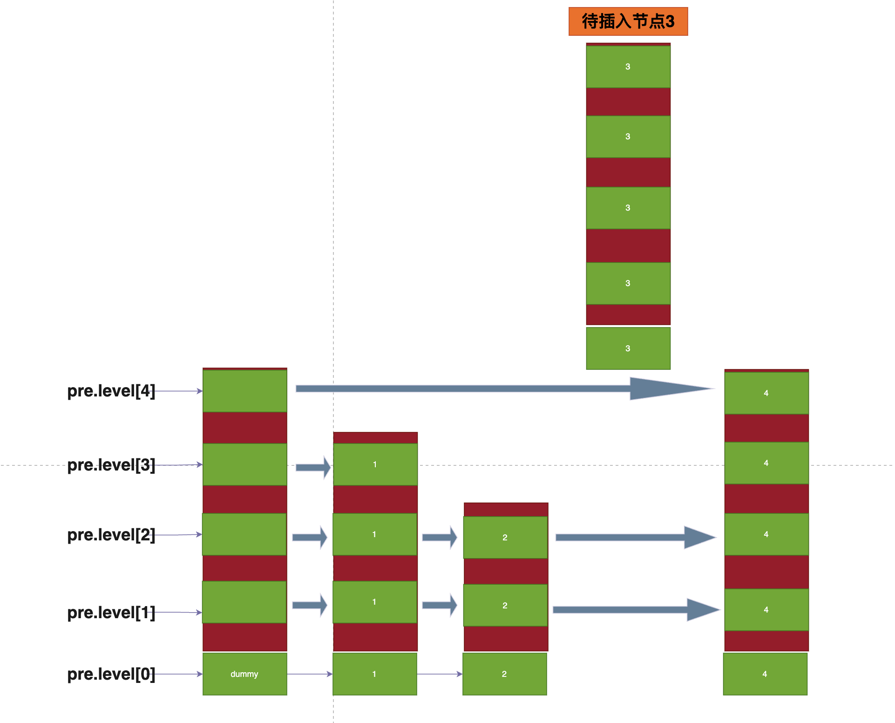
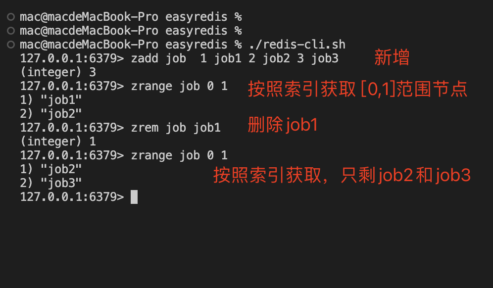

# Golang实现自己的Redis(有序集合)

用11篇文章实现一个可用的Redis服务，姑且叫**EasyRedis**吧，希望通过文章将Redis掰开撕碎了呈现给大家，而不是仅仅停留在八股文的层面，并且有非常爽的感觉，欢迎持续关注学习。

项目代码地址: https://github.com/gofish2020/easyredis 欢迎Fork & Star

- [x] easyredis之TCP服务 
- [x] easyredis之网络请求序列化协议（RESP）
- [x] easyredis之内存数据库
- [x] easyredis之过期时间 (时间轮实现)
- [x] easyredis之持久化 （AOF实现）
- [x] easyredis之发布订阅功能
- [x] easyredis之有序集合（跳表实现）
- [ ] easyredis之 pipeline 客户端实现
- [ ] easyredis之事务（原子性/回滚）
- [ ] easyredis之连接池
- [ ] easyredis之分布式集群存储

## 【第七篇】EasyRedis之有序集合（跳表实现）

有序集合需求分析：
- 集合：同一个member只能出现一次（去重）
- 有序：可以正序or倒序遍历

Golang中去重我们可以使用map去重，有序则使用链表。所以有序集合的数据结构定义如下:

```go
// score可以相同，member不能重复
type SortedSet struct {
	dict map[string]*Pair // 利用map基于member去重
	skl  *skiplist        // 利用skl进行排序
}

// 要存储的值
type Pair struct {
	Member string
	Score  float64
}
```

那应该怎么利用链表实现有序的？很简单，插入/修改/删除都保证链表的有序性，那整个链表最后肯定就是一直有序的


例如：要插入节点9，为了保证链表的有序行，需要找到前驱节点。
前驱节点：即比9小的节点中的【最大的一个】。1/2/3/4/5都比9小，但是这些小的当中最大的一个是5。查找的方式简单粗暴，就是遍历链表，从头开始遍历。
伪代码：

```go

type  node struct{
	val int64
}

var curNode *node = &node{val:9}

if pre.next != nil && pre.next.val < curNode.val
{
	pre = pre.next
}

// 插入
pre.next = curNode

```



可以看出，每次我要插入一个新节点，都是要遍历链表，定位出前驱节点，随着链表长度越来越长，是不是整个链表的插入效率就越来越差。那有没有办法快速定位到链表中的前驱节点。

这里就引申出了跳表的实现。
跳表的本质就是**链表**，只是链表节点个头长高了。普通的链表只有一层，跳表是包含多层的链表，


当我们要查找前驱节点5的时候,
伪代码如下:

```go


type Level struct {
    forward *node// 每层的指向
    span int64 // 每层的跨度
}

type node struct {
    val int64
    level []*Level //每个节点的层
}


var maxlevel = 5

// 被插入的节点9 
var curNode *node = &node{val:9}

// dummy 节点
var dummy *node = &node{val:0}
// pre一开始指向dummy节点
var pre *node = dummy
// 从最高层开始，这里的i表示层高索引
for i := maxlevel-1;i >= 0;i-- {

    for pre.level[i].forward != nil && pre.level[i].forward.val < curNode.val {
        pre = pre.level[i].forward
    }

}

```

- 从最高层开始进行遍历，这里的最高层是 `pre.level[4]`
- 当 `pre.level[4].forward != nil && pre.level[4].forward.val < 9`，更新`pre`的指向节点4。继续重复for循环过程，因为pre指向了节点4，所以 `pre.level[4].forward == nil`，（结合下图理解）跳出内部的for循环，外部的for循环会将层高i-1。即：降层
- 等到所有的层级全部遍历完成以后，此时`pre`的指向就是最终的节点5



通过这种给节点增加层高的概念，可以看到找到节点5，我们只需要跳跃两次从`dummy -> 节点4 -> 节点5`，比遍历单层的链表效率高了很多。


### 有序集合代码讲解

有了上面的基础知识，就以`zadd key score member`向有序集合中插入为例讲解下代码。
入口函数位于`engine/sortedset.go`

```go
// zadd key score member [score member...]
func cmdZAdd(db *DB, args [][]byte) protocol.Reply {

	//... 省略...
    // 获取有序集合对象
	sortedSet, _, reply := db.getOrInitSortedSetObject(key)
	if reply != nil {
		return reply
	}

	// 将pairs保存到有序集合中
	i := int64(0)
	for _, pair := range pairs {
		if sortedSet.Add(pair.Member, pair.Score) {
			i++ // 新增的个数
		}
	}

	//... 省略...
}
```
其实就是调用`sortedSet.Add(pair.Member, pair.Score)`函数.
在有序集合中，通过map保证member的唯一性（去重）；如果有重复的，跳表中会先删除；通过 `s.skl.insert(member, score)`将数据插入到跳表中，并保证有序行；
```go
// bool 为true表示新增， false表示修改
func (s *SortedSet) Add(member string, score float64) bool {
	pair, ok := s.dict[member]

	s.dict[member] = &Pair{
		Member: member,
		Score:  score,
	}

	// 说明是重复添加
	if ok {
		// 分值不同
		if score != pair.Score {
			// 将原来的从跳表中删除
			s.skl.remove(pair.Member, pair.Score)
			// 插入新值
			s.skl.insert(member, score)
		}
		// 分值相同，do nothing...
		return false
	}
	// 新增
	s.skl.insert(member, score)
	return true
}

```

插入的逻辑细节很多，但是思想不复杂；因为跳表是多层的，所以插入一个新节点的时候，【每层的前驱节点】需要记录下来`beforeNode`。如下图：

如果我向插入一个节点3
- 在`level[4]`第4层的前驱节点是 dummy
- 在`level[3]`第3层的前驱节点是 1
- 在`level[2]`第2层的前驱节点是 2
- 在`level[1]`第1层的前驱节点是 2
- 在`level[0]`第0层的前驱节点是 2

可以看到每一层的前驱节点是不一定相同的，所以每一层都记录下来，当节点3要插入的时候，需要每一层进行相连接。

完整代码如下：
```go
// 增
func (s *skiplist) insert(member string, score float64) *node {

	beforeNode := make([]*node, defaultMaxLevel)      // 每一层的前驱节点
	beforeNodeOrder := make([]int64, defaultMaxLevel) // 每一层的前驱节点排序编号

	node := s.header
	// i从最高层遍历，通过遍历，将member和score在每一层的前驱节点全部保存在 beforeNode中，以及节点的排序保存在beforeNodeOrder
	for i := s.maxLevel - 1; i >= 0; i-- {

		// 节点node的排序
		if i == s.maxLevel-1 {
			beforeNodeOrder[i] = 0
		} else {
			beforeNodeOrder[i] = beforeNodeOrder[i+1]
		}
		// 节点node在当前i层的forward不为空
		for node.levels[i].forward != nil &&
			// node在层levels[i]的forward节点，分值 < score 或者 分值相同但是成员 < member，说明forward指向的节点，作为下一个前驱节点
			(node.levels[i].forward.Score < score || (node.levels[i].forward.Score == score && node.levels[i].forward.Member < member)) {

			beforeNodeOrder[i] += int64(node.levels[i].span) // 更新节点node的编号
			node = node.levels[i].forward                    // 更新当前节点node
		}
		beforeNode[i] = node
	}

	// 新节点层高
	newLevel := randomLevel()
	// 如果新层高比当前已经存在的层高s.maxLevel都要高，说明还缺少了 newLevel - s.maxLevel范围的前驱节点
	if newLevel > s.maxLevel {
		for i := s.maxLevel; i < newLevel; i++ {
			// beforeNode[i] 表示在i层的前驱节点
			beforeNode[i] = s.header
			beforeNodeOrder[i] = 0
			beforeNode[i].levels[i].forward = nil
			beforeNode[i].levels[i].span = s.length
		}
	}

	node = newNode(newLevel, member, score)

	// 将节点插入到多层链表中，仅仅对[0,newLevel）范围进行节点拼接
	for i := int16(0); i < newLevel; i++ {
		//也就是在每一层插入节点
		node.levels[i].forward = beforeNode[i].levels[i].forward
		beforeNode[i].levels[i].forward = node

		// 更新本层节点跨度
		node.levels[i].span = beforeNode[i].levels[i].span - (beforeNodeOrder[0] - beforeNodeOrder[i])
		beforeNode[i].levels[i].span = beforeNodeOrder[0] - beforeNodeOrder[i] + 1
	}

	// 如果新节点的高度很低，比最高低很多
	for i := newLevel; i < s.maxLevel; i++ {
		beforeNode[i].levels[i].span++ // 超过的节点的跨度默认+1
	}

	// 修改第0层的 backward指向
	if beforeNode[0] == s.header {
		node.backward = nil
	} else {
		node.backward = beforeNode[0]
	}

	if node.levels[0].forward != nil {
		node.levels[0].forward.backward = node
	} else { // 说明node是最后一个节点
		s.tailer = node
	}
	// 因为新增，数量+1
	s.length++
	return node
}


```

代码中还有一个细节：节点3的高度因为是随机的，可能很高，也可能很矮
- 当很高的时候，超过当前最高的部分的前驱节点就是s.header
代码细节：
```go
// 如果新层高比当前已经存在的层高s.maxLevel都要高，说明还缺少了 newLevel - s.maxLevel范围的前驱节点
	if newLevel > s.maxLevel {
		for i := s.maxLevel; i < newLevel; i++ {
			// beforeNode[i] 表示在i层的前驱节点
			beforeNode[i] = s.header
			beforeNodeOrder[i] = 0
			beforeNode[i].levels[i].forward = nil
			beforeNode[i].levels[i].span = s.length
		}
	}
```
- 当很矮的时候，比最高部分矮的部分前驱节点，需要span+1
代码细节：
```go

// 如果新节点的高度很低，比最高低很多
	for i := newLevel; i < s.maxLevel; i++ {
		beforeNode[i].levels[i].span++ // 超过的节点的跨度默认+1
	}

```

### 效果演示

