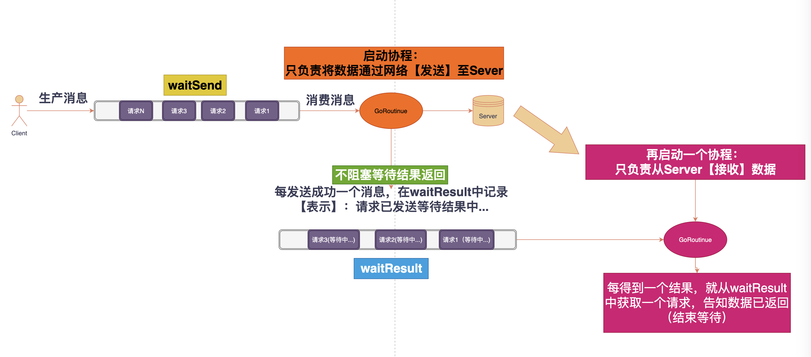

# Golang实现自己的Redis (pipeline客户端)

用11篇文章实现一个可用的Redis服务，姑且叫**EasyRedis**吧，希望通过文章将Redis掰开撕碎了呈现给大家，而不是仅仅停留在八股文的层面，并且有非常爽的感觉，欢迎持续关注学习。

项目代码地址: https://github.com/gofish2020/easyredis 欢迎Fork & Star

- [x] easyredis之TCP服务 
- [x] easyredis之网络请求序列化协议（RESP）
- [x] easyredis之内存数据库
- [x] easyredis之过期时间 (时间轮实现)
- [x] easyredis之持久化 （AOF实现）
- [x] easyredis之发布订阅功能
- [x] easyredis之有序集合（跳表实现）
- [x] easyredis之 pipeline 客户端实现
- [ ] easyredis之事务（原子性/回滚）
- [ ] easyredis之连接池
- [ ] easyredis之分布式集群存储

## 【第八篇】EasyRedis之pipeline客户端


网络编程的一个基础知识：用同一个sokcet连接发送多个数据包的时候，我们一般的做法是，发送并立刻接收结果，在没有接收到，是不会继续发送数据包。这种方法简单，但是效率太低。时间都浪费在等待上了...

socket的【发送缓冲区和接收缓冲区】是分离的，也就是发送不用等待接收，接收也不用等待发送。

所以我们可以把我们要发送的多个数据包【数据包1/数据包2...数据包N】复用同一个连接，通过**发送缓冲区**按顺序都发送给服务端。服务端处理请求的顺序，也是按照【数据包1/数据包2...数据包N】这个顺序处理的。当处理完以后，处理结果将按照【数据包结果1/数据包结果2...数据包结果N】顺序发送给客户端的**接收缓冲区**。客户端只需要从接收缓冲区中读取数据，并保存到请求数据包上，即可。这样我们就可以将发送和接收分离开来。一个协程只负责发送，一个协程只负责接收，互相不用等待。关键在于保证**发送和接收的顺序是相同的**
设计逻辑图如下：


代码路径`redis/client/client.go`
整个代码也就是200多行，结合上图非常容易理解

### 创建客户端

```go
type RedisClent struct {
	// socket连接
	conn net.Conn

	addr string
	// 客户端当前状态
	connStatus atomic.Int32

	// heartbeat
	ticker time.Ticker

	// buffer cache
	waitSend   chan *request
	waitResult chan *request

	// 有请求正在处理中...
	working sync.WaitGroup
}

// 创建redis客户端socket
func NewRedisClient(addr string) (*RedisClent, error) {
	conn, err := net.Dial("tcp", addr)
	if err != nil {
		return nil, err
	}

	rc := RedisClent{}
	rc.conn = conn
	rc.waitSend = make(chan *request, maxChanSize)
	rc.waitResult = make(chan *request, maxChanSize)
	rc.addr = addr
	return &rc, nil
}

// 启动
func (rc *RedisClent) Start() error {
	rc.ticker = *time.NewTicker(heartBeatInterval)
	// 将waitSend缓冲区进行发送
	go rc.execSend()
	// 获取服务端结果
	go rc.execReceive()
	// 定时发送心跳
	go rc.execHeardBeat()
	rc.connStatus.Store(connRunning) // 启动状态
	return nil
}
```

### 发送Redis命令

将`command [][]byte`保存到缓冲区 `rc.waitSend`中

```go
// 将redis命令保存到 waitSend 中
func (rc *RedisClent) Send(command [][]byte) (protocol.Reply, error) {

	// 已关闭
	if rc.connStatus.Load() == connClosed {
		return nil, errors.New("client closed")
	}

	req := &request{
		command: command,
		wait:    wait.Wait{},
	}
	// 单个请求
	req.wait.Add(1)

	// 所有请求
	rc.working.Add(1)
	defer rc.working.Done()

	// 将数据保存到缓冲中
	rc.waitSend <- req

	// 等待处理结束
	if req.wait.WaitWithTimeOut(maxWait) {
		return nil, errors.New("time out")
	}
	// 出错
	if req.err != nil {
		err := req.err
		return nil, err
	}
	// 正常
	return req.reply, nil
}
```


### 发送Redis命令到服务端

```go
// 将waitSend缓冲区进行发送
func (rc *RedisClent) execSend() {
	for req := range rc.waitSend {
		rc.sendReq(req)
	}
}

func (rc *RedisClent) sendReq(req *request) {
	// 无效请求
	if req == nil || len(req.command) == 0 {
		return
	}

	var err error
	// 网络请求（重试3次）
	for i := 0; i < 3; i++ {
		_, err = rc.conn.Write(req.Bytes())
		// 发送成功 or 发送错误（除了超时错误和deadline错误）跳出
		if err == nil ||
			(!strings.Contains(err.Error(), "timeout") && // only retry timeout
				!strings.Contains(err.Error(), "deadline exceeded")) {
			break
		}
	}

	if err == nil { // 发送成功，异步等待结果
		rc.waitResult <- req
	} else { // 发送失败，请求直接失败
		req.err = err
		req.wait.Done()
	}
}


```

### 从服务端读取数据

```go
func (rc *RedisClent) execReceive() {

	ch := parser.ParseStream(rc.conn)

	for payload := range ch {

		if payload.Err != nil {
			if rc.connStatus.Load() == connClosed { // 连接已关闭
				return
			}

			// 否则，重新连接（可能因为网络抖动临时断开了）

			rc.reconnect()
			return
		}

		// 说明一切正常

		rc.handleResult(payload.Reply)
	}
}

func (rc *RedisClent) handleResult(reply protocol.Reply) {
	// 从rc.waitResult 获取一个等待中的请求，将结果保存进去
	req := <-rc.waitResult
	if req == nil {
		return
	}
	req.reply = reply
	req.wait.Done() // 通知已经获取到结果
}

```


### 断线重连

因为网络抖动可能存在连接断开的情况，所以需要有重连的功能

```go
func (rc *RedisClent) reconnect() {
	logger.Info("redis client reconnect...")
	rc.conn.Close()

	var conn net.Conn
	// 重连（重试3次）
	for i := 0; i < 3; i++ {
		var err error
		conn, err = net.Dial("tcp", rc.addr)
		if err != nil {
			logger.Error("reconnect error: " + err.Error())
			time.Sleep(time.Second)
			continue
		} else {
			break
		}
	}
	// 服务端连不上，说明服务可能挂了（or 网络问题 and so on...)
	if conn == nil { 
		rc.Stop()
		return
	}

	// 这里关闭没问题，因为rc.conn.Close已经关闭，函数Send中保存的请求因为发送不成功，不会写入到waitResult
	close(rc.waitResult)
	// 清理 waitResult(因为连接重置，新连接上只能处理新请求，老的请求的数据结果在老连接上,老连接已经关了，新连接上肯定是没有结果的)
	for req := range rc.waitResult {
		req.err = errors.New("connect reset")
		req.wait.Done()
	}

	// 新连接（新气象）
	rc.waitResult = make(chan *request, maxWait)
	rc.conn = conn

	// 重新启动接收协程
	go rc.execReceive()
}

```
