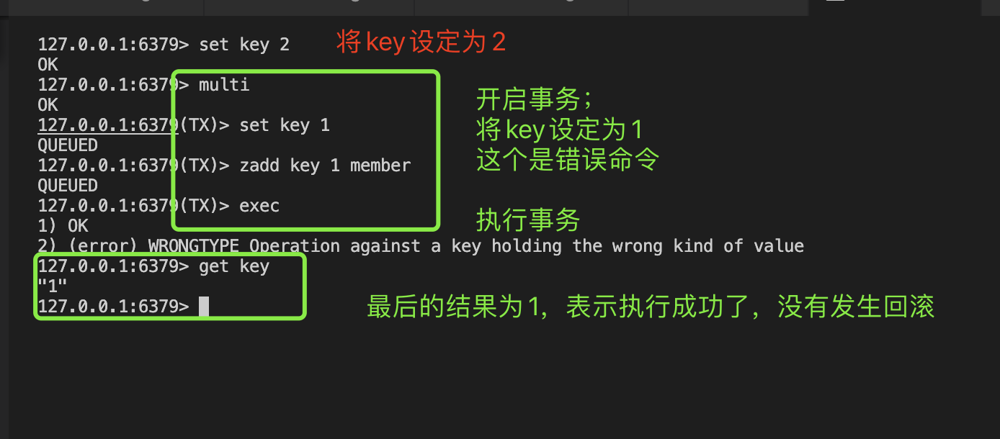
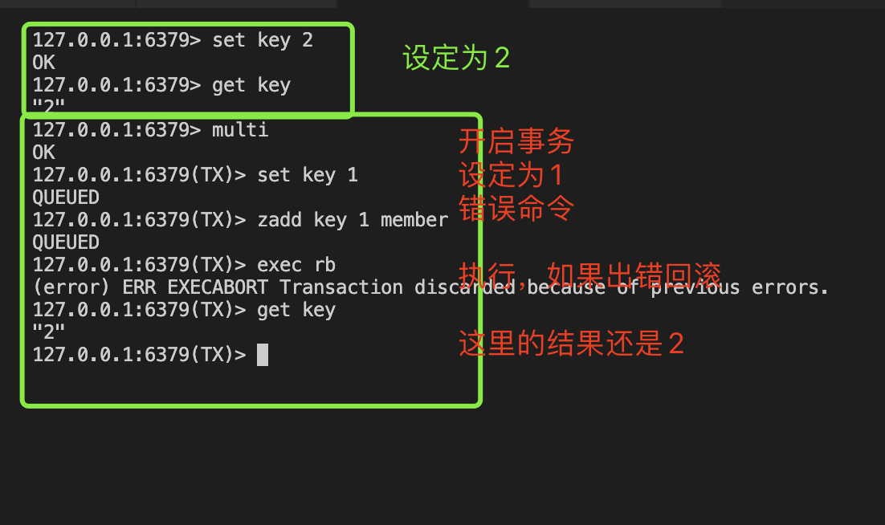

用11篇文章实现一个可用的Redis服务，姑且叫**EasyRedis**吧，希望通过文章将Redis掰开撕碎了呈现给大家，而不是仅仅停留在八股文的层面，并且有非常爽的感觉，欢迎持续关注学习。

项目代码地址: https://github.com/gofish2020/easyredis 欢迎Fork & Star

- [x] easyredis之TCP服务 
- [x] easyredis之网络请求序列化协议（RESP）
- [x] easyredis之内存数据库
- [x] easyredis之过期时间 (时间轮实现)
- [x] easyredis之持久化 （AOF实现）
- [x] easyredis之发布订阅功能
- [x] easyredis之有序集合（跳表实现）
- [x] easyredis之 pipeline 客户端实现
- [x] easyredis之事务（原子性/回滚）
- [ ] easyredis之连接池
- [ ] easyredis之分布式集群存储


## 【第九篇】EasyRedis之事务实现


本篇实现的Redis命令如下：
```go
Multi : 开启事务
Exec [rb]：执行事务
Watch key [key...]：监视key在事务执行之前不能发生变更,如果事务执行时发现有变更，事务终止执行
Unwatch:取消监视
Discard: 退出事务
```

如何实现事务的原子性和回滚？
- 这里我们可以联想MYSQL如何实现事务的原子性。当mysql的存储引擎采用Innodb并且事务的隔离级别为可重复读（RR）的时候，
MYSQL的读可以分成【当前读】和【快照读】；【当前读】采用的机制就是加锁。【快照读】的机制就是利用MVCC的原理，在开启事务的时候，生成一个事务版本，并根据记录中的undo log链表中的每个记录的事务版本号比对，判断自己是否可以读写该条记录（这个相当于无锁）。如果对MYSQL的八股文不了解的可以看这篇文章 https://xiaolincoding.com/mysql/transaction/mvcc.html
- 回滚如何实现：很简单，比如本次我们要插入一条记录，回滚就删除一条记录。如果是修改一条记录，那就把修改前的记录记下来，回滚就将记录恢复回去即可。如果是删除记录，那就把记录先记录下来，回滚就是再插入回去即可。


在本次的项目中，我们将使用【锁】保证原子性，使用【记录原始数据】的方式实现回滚。

我们依次看下各个命令的关键代码：

本篇代码的入口位于`engine/database.go`

```go

func (db *DB) Exec(c abstract.Connection, redisCommand [][]byte) protocol.Reply {

	cmdName := strings.ToLower(string(redisCommand[0]))

	if cmdName == "multi" {
		if len(redisCommand) != 1 {
			return protocol.NewArgNumErrReply(cmdName)
		}
		return StartMulti(c) // 开启事务
	} else if cmdName == "discard" {
		if len(redisCommand) != 1 {
			return protocol.NewArgNumErrReply(cmdName)
		}
		return DiscardMulti(c) // 取消事务
	} else if cmdName == "watch" {
		return Watch(db, c, redisCommand[1:]) // 监视watch key [key...]
	} else if cmdName == "unwatch" {
		if len(redisCommand) != 1 {
			return protocol.NewArgNumErrReply(cmdName)
		}
		return UnWatch(db, c) // 取消监视
	} else if cmdName == "exec" {
		return ExecMulti(db, c, redisCommand[1:]) // 执行事务
	}

	// **事务模式** 将命令入队到命令缓冲队列中
	if c != nil && c.IsTransaction() {
		return EnqueueCmd(c, redisCommand)
	}

	// ** 普通模式 **
	return db.execNormalCommand(c, redisCommand)
}

```
#### multi 开启事务
事务的执行是基于当前的socket连接，所以设定开启事务，其实就是设定socket连接为开始事务状态（设定为true）
```go
// 开启事务
func StartMulti(c abstract.Connection) protocol.Reply {
	if c.IsTransaction() {
		return protocol.NewGenericErrReply("multi is already start,do not repeat it")
	}
	// 设定开启
	c.SetTransaction(true)
	return protocol.NewOkReply()
}

// socket连接
func (k *KeepConnection) SetTransaction(val bool) {
	if !val { // 取消事务模式，清空队列和watch key
		k.queue = nil
		k.watchKey = nil
		k.txErrors = nil
	}
	// 开启事务状态
	k.trx.Store(val)
}
```
一旦开启事务以后，后续的redis命令不再执行直接，而是会缓存起来。最后在执行`exec`命令的时候一次性批量执行。

```go

//... 省略

// **事务模式** 将命令入队到命令缓冲队列中
	if c != nil && c.IsTransaction() {
		return EnqueueCmd(c, redisCommand)
	}

//... 省略
```

#### discard 取消事务
可以看到和上面的开启是一个相反的操作，设置为false
```go
// 取消事务
func DiscardMulti(c abstract.Connection) protocol.Reply {
	if !c.IsTransaction() {
		return protocol.NewGenericErrReply("DISCARD without MULTI")
	}
	// 取消开启
	c.SetTransaction(false)
	return protocol.NewOkReply()
}

```

#### watch监视
这个命令平时应该用的不多。含义：监视key，希望在执行命令的时候没有发生过变化。例如我出门之前，我在门上做了一个标记，如果在我出门之后，门口的标记没有变动过，说明在我出门的这个期间没有人来过。否则就认定有人来过我家。我就赶快报警，不进门了。那这个标记的实现方案就是利用版本号的机制，针对key记录一个值，执行命令的时候，比对下该值（版本号）有没有变化即可。

实际变更版本号的代码，继续往下看就可以看到。
```go
// 监视 key [key...]
func Watch(db *DB, conn abstract.Connection, args [][]byte) protocol.Reply {
	if len(args) < 1 {
		return protocol.NewArgNumErrReply("WATCH")
	}
	if conn.IsTransaction() {
		return protocol.NewGenericErrReply("WATCH inside MULTI is not allowed")
	}
	watching := conn.GetWatchKey()
	for _, bkey := range args {
		key := string(bkey)
		watching[key] = db.GetVersion(key) // 保存当前key的版本号（利用版本号机制判断key是否有变化）
	}
	return protocol.NewOkReply()
}

```


#### Unwatch 取消监视

```go
// 清空watch key
func UnWatch(db *DB, conn abstract.Connection) protocol.Reply {
	conn.CleanWatchKey()
	return protocol.NewOkReply()
}

```


#### Exec 执行事务

批量执行命令，这里我自己设计了一个`rb`参数（标准里面没有）表示如果执行错误，自动回滚。默认情况下，命令会全部执行，出现错误不会回滚

```go
// 执行事务  exec rb
func ExecMulti(db *DB, conn abstract.Connection, args [][]byte) protocol.Reply {

	// 说明当前不是【事务模式】
	if !conn.IsTransaction() {
		return protocol.NewGenericErrReply("EXEC without MULTI")
	}
	// 执行完，自动退出事务模式
	defer conn.SetTransaction(false)

	// 如果在入队的时候，就有格式错误，直接返回
	if len(conn.GetTxErrors()) > 0 {
		return protocol.NewGenericErrReply("EXECABORT Transaction discarded because of previous errors.")
	}

	// 是否自动回滚（这里是自定义的一个参数，标准redis中没有）
	isRollBack := false
	if len(args) > 0 && strings.ToUpper(string(args[0])) == "RB" { // 有rb参数，说明要自动回滚
		isRollBack = true
	}
	// 获取所有的待执行命令
	cmdLines := conn.GetQueuedCmdLine()
	return db.execMulti(conn, cmdLines, isRollBack)
}

```
前面就是一个基本的状态判断，最后真正执行的函数是`db.execMulti(conn, cmdLines, isRollBack)`代码如下：

- 在代码执行前，将所有命令的key全部都提取出来，分成【读key】【写key】。例如`set key value`这里的key就是写key. `get key`这里的key就是读key。【写key】就是对数据会进行变更，【读key】只是读，不会对值发生变更。
- 如果有watch key看下版本号是否发生改变
- 接下来最重要的来了，就是对所有的key上锁（原子性），保证所有的命令一起执行（读key上读锁，写key上写锁）
- 锁上完以后，就执行所有的命令。如果需要回滚，那么在命令执行之前，将原始的数据通过`db.GetUndoLog(cmdLine)`函数记录原始数据的回滚命令。
- 如果需要执行回滚命令（就【倒序】执行所有的回滚命令）。还记得上面有对key加锁吧，所以这里是可以直接执行回滚（因为锁保证原子性）
- 最后对【写key】更新版本号（表示发生了状态变更），这里就和前面的记录版本号对应起来了

```go
// 执行事务：本质就是一堆命令一起执行， isRollback 表示出错是否回滚
func (db *DB) execMulti(conn abstract.Connection, cmdLines []CmdLine, isRollback bool) protocol.Reply {

	// 命令的执行结果
	results := make([]protocol.Reply, len(cmdLines))

	versionKeys := make([][]string, len(cmdLines))

	var writeKeys []string
	var readKeys []string
	for idx, cmdLine := range cmdLines {
		cmdName := strings.ToLower(string(cmdLine[0]))
		cmd, ok := commandCenter[cmdName]
		if !ok {
			// 这里正常不会执行
			continue
		}
		keyFunc := cmd.keyFunc
		readKs, writeKs := keyFunc(cmdLine[1:])
		// 读写key
		readKeys = append(readKeys, readKs...)
		writeKeys = append(writeKeys, writeKs...)
		// 写key需要 变更版本号
		versionKeys[idx] = append(versionKeys[idx], writeKs...)
	}

	watchingKey := conn.GetWatchKey()
	if isWatchingChanged(db, watchingKey) { // 判断watch key是否发生了变更
		return protocol.NewEmptyMultiBulkReply()
	}

	// 所有key上锁（原子性）
	db.RWLock(readKeys, writeKeys)
	defer db.RWUnLock(readKeys, writeKeys)

	undoCmdLines := [][]CmdLine{}
	aborted := false
	for idx, cmdLine := range cmdLines {

		// 生成回滚命令
		if isRollback {
			undoCmdLines = append(undoCmdLines, db.GetUndoLog(cmdLine))
		}

		// 执行命令
		reply := db.execWithLock(cmdLine)
		if protocol.IsErrReply(reply) { // 执行出错
			if isRollback { // 需要回滚
				undoCmdLines = undoCmdLines[:len(undoCmdLines)-1] // 命令执行失败（不用回滚），剔除最后一个回滚命令
				aborted = true
				break
			}
		}
		// 执行结果
		results[idx] = reply
	}
	// 中断，执行回滚
	if aborted {
		size := len(undoCmdLines)
		// 倒序执行回滚指令（完成回滚）
		for i := size - 1; i >= 0; i-- {
			curCmdLines := undoCmdLines[i]
			if len(curCmdLines) == 0 {
				continue
			}
			for _, cmdLine := range curCmdLines {
				db.execWithLock(cmdLine)
			}
		}
		return protocol.NewGenericErrReply("EXECABORT Transaction discarded because of previous errors.")
	}

	// 执行到这里，说明命令执行完成（可能全部成功，也可能部分成功）
	for idx, keys := range versionKeys {
		if !protocol.IsErrReply(results[idx]) { // 针对执行成功的命令（写命令），变更版本号
			db.addVersion(keys...)
		}
	}
	// 将多个命令执行的结果，进行合并返回
	mixReply := protocol.NewMixReply()
	mixReply.Append(results...)
	return mixReply
}

```

##### 效果演示（无回滚）




##### 效果演示（有回滚）




因为`set key 1`将key的内存对象设定为`字符串`;
而`zadd key 1 member`操作的内存对象是`有序集合`；
内存对象不对，所以不能执行。这就是出错的原因。